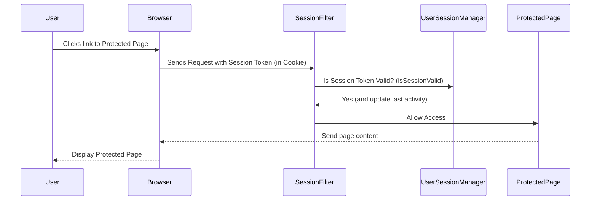

# Chapter 1: User Session Management

Welcome to the first chapter of the `AuctionSystem` tutorial! We're going to start by looking at a fundamental concept for any application where users log in: **User Session Management**.

Imagine you log into an online auction site. You expect the site to remember who you are as you browse different auctions, place bids, or update your profile. You don't want to type your username and password every single time you click a link! You also expect your account to be secure, and perhaps automatically log you out if you step away from your computer for a while.

This is exactly the problem that User Session Management solves.

Think of it like visiting a large building with different restricted areas. When you first enter the building (log in), you get a temporary pass (your session). This pass has a unique ID (your session token). As you move between different areas (browse different pages or features on the website), you show your pass at various checkpoints (the system checks your session token). The checkpoints verify your pass is valid and keep track of where you've been recently. If you leave your pass unattended for too long, it might automatically expire, and you'll need to get a new one.

In our `AuctionSystem`, the **User Session Management** component is like this central "security desk" that handles these tasks:

*   Issuing a unique "pass" (session token) when someone successfully logs in.
*   Checking the validity of that "pass" every time a user tries to do something that requires them to be logged in.
*   Keeping track of user activity to know if a session is still being used.
*   Allowing users to "hand back their pass" (log out).
*   Automatically expiring passes that haven't been used for a certain time.
*   Adding extra security checks, like making sure the person using the pass is the same one who received it (checking things like IP address or browser details).

Let's look at the core pieces that make this work in the `AuctionSystem`.

## Key Concepts

The User Session Management relies on a few simple ideas:

1.  **Session:** This represents a single instance of a user being logged in. If you log in on your desktop computer and then also log in on your phone, those are two separate sessions for the same user.
2.  **Session Token:** This is a unique, random string of characters created when a session starts. Instead of sending your username and password with every request, your browser just sends this token. The server uses the token to identify *your* session.
3.  **Active Session Information (`ActiveSessionInfo`)**: This is the data stored for each active session. It includes the session token, the username, when the session started, when the user was last active, and some details about the user's connection (like IP address and browser type).
4.  **Session Manager (`UserSessionManagerRemote`/`UserSessionManagerBean`)**: This is the central piece of logic (implemented as a special kind of Java component called an EJB - Enterprise JavaBean) that performs all the session management tasks we discussed. It's the "security desk" itself.
5.  **Session Filter (`SessionFilter`)**: This acts like the "checkpoints" throughout the application. It intercepts incoming requests and uses the Session Manager to verify the user's session token *before* allowing them to access secured parts of the site.

## How it Works: The Basic Flow

Let's trace what happens when a logged-in user browses a page that requires them to be authenticated (like viewing their bids).



1.  **User Action:** The user clicks a link or submits a form that requires them to be logged in.
2.  **Browser Sends Request:** The user's web browser automatically includes the session token (usually stored in a cookie) with the request to the server.
3.  **Filter Intercepts:** The `SessionFilter` (which we'll cover in more detail in [Chapter 4: Filters](04_filters__session__admin__encoding_.md)) intercepts the request *before* it reaches the target page (a Servlet in our case).
4.  **Filter Asks Session Manager:** The `SessionFilter` takes the session token from the request and asks the `UserSessionManager` if this token corresponds to a valid, active session (`isSessionValid`).
5.  **Session Manager Checks:** The `UserSessionManager` looks up the token in its internal list of active sessions. It checks if the token exists, if the session hasn't expired due to inactivity, and might perform security checks (like verifying the IP address). If valid, it also updates the "last active" time for that session (`updateSessionActivity`).
6.  **Session Manager Responds:** The `UserSessionManager` tells the `SessionFilter` whether the session is valid or not.
7.  **Filter Decides:**
    *   If the session is valid, the `SessionFilter` allows the request to continue to the intended page (`ProtectedPage`).
    *   If the session is *not* valid (missing token, expired, security check failed), the `SessionFilter` stops the request and redirects the user to the login page, often with an error message.
8.  **Protected Page Responds:** If the request was allowed, the Protected Page (e.g., a Servlet) does its job (like fetching user-specific data) and sends the response back to the browser.

This flow happens for almost *every* request that needs a logged-in user, ensuring that only authenticated users can access sensitive information or perform actions like placing bids.

## Using the Session Manager

Other parts of our application interact with the `UserSessionManager`. They don't need to know *how* it keeps track of sessions, only *how* to ask it questions or tell it to do something.

The `UserSessionManagerRemote` interface defines all the things the session manager can do. You can see this in the code snippet:

```java
// --- File: src/main/java/com/auction/session/UserSessionManagerRemote.java ---
package com.auction.session;

import jakarta.ejb.Remote;
// ... imports ...

@Remote
public interface UserSessionManagerRemote {
    // Session creation and validation
    String createUserSession(String username, String sessionId, String ipAddress, String userAgent);
    boolean isSessionValid(String sessionToken);
    boolean isUserLoggedIn(String username); // Checks if *any* session is valid for a user

    // Session management
    void logout(String sessionToken); // Log out a specific session
    void logoutUser(String username); // Log out *all* sessions for a user

    // Session information
    ActiveSessionInfo getSessionInfo(String sessionToken);
    List<ActiveSessionInfo> getAllActiveSessions(); // Get list of all active sessions

    // ... other methods for cleanup, security, stats ...
}
```
This interface acts like a contract. It tells other parts of the application, "Here's what you can ask the Session Manager to do, and here's what kind of information you need to provide or expect back."

Let's look at simple examples of how parts of the system *use* these methods.

When a user successfully logs in (authentication logic, not shown here), the system needs to create a new session:

```java
// Example: Inside a login handling logic (conceptual)
// After verifying username/password...
String sessionToken = sessionManager.createUserSession(
    username, // The user who just logged in
    httpSession.getId(), // The underlying server session ID
    getClientIpAddress(httpRequest), // User's IP address
    httpRequest.getHeader("User-Agent") // User's browser/OS info
);

// Store the token so the filter can find it later
httpSession.setAttribute("sessionToken", sessionToken);
httpSession.setAttribute("username", username);
```
This code snippet shows how, after a successful login, we call `createUserSession` on the `sessionManager` to get a new unique token. We then store this token in the standard `HttpSession` so that the `SessionFilter` can find it on subsequent requests.

The `SessionFilter` is constantly using the manager to check validity:

```java
// Example: Inside SessionFilter.doFilter method
// ... get sessionToken from httpSession ...

if (sessionToken != null && sessionManager.isSessionValid(sessionToken)) {
    // Session is valid! Update activity and perform security checks
    sessionManager.updateSessionActivity(sessionToken);

    String ipAddress = getClientIpAddress(httpRequest);
    String userAgent = httpRequest.getHeader("User-Agent");

    if (!sessionManager.validateSessionSecurity(sessionToken, ipAddress, userAgent)) {
        // Security mismatch! Invalidate the session
        sessionManager.invalidateSession(sessionToken);
        redirectToLogin(httpResponse); // Redirect to login
        return; // Stop processing this request
    }

    // All good, let the request go to the intended destination
    chain.doFilter(request, response);

} else {
    // Session is NOT valid (null token, expired, etc.)
    // ... potentially invalidate httpSession ...
    redirectToLogin(httpResponse); // Redirect to login
}
```
This snippet from the `SessionFilter` shows the core loop: get the token, ask `sessionManager.isSessionValid()`, and if it's valid, update activity (`updateSessionActivity`) and do security checks (`validateSessionSecurity`). If *anything* fails, the filter redirects the user. This is the gatekeeper function in action.

Finally, an administrative page ([`SessionAdminServlet`](#code-sessionsadminservletjava)) uses the manager to view and control sessions:

```java
// Example: Inside SessionAdminServlet.showActiveSessionsTable method
List<ActiveSessionInfo> sessions = sessionManager.getAllActiveSessions();

// ... then loop through the list to display session details in a table ...

// Example: Inside SessionAdminServlet.doPost method for logout
if ("logoutSession".equals(action) && sessionToken != null) {
    sessionManager.logout(sessionToken); // Call manager to end session
    // ... redirect ...
} else if ("logoutUser".equals(action) && username != null) {
    sessionManager.logoutUser(username); // Call manager to end all user sessions
    // ... redirect ...
}
```
These snippets show how the admin interface retrieves a list of all active sessions from the manager (`getAllActiveSessions`) to display them, and how it calls `logout` or `logoutUser` on the manager to terminate sessions remotely.

## Under the Hood: Implementation Details

The actual logic for managing sessions lives inside the `UserSessionManagerBean.java` file.

```java
// --- File: src/main/java/com/auction/session/UserSessionManagerBean.java ---
package com.auction.session;

import jakarta.annotation.PostConstruct;
import jakarta.ejb.*;
import java.security.SecureRandom;
import java.time.LocalDateTime;
import java.util.*;
import java.util.concurrent.ConcurrentHashMap; // Important for thread safety
import java.util.logging.Logger;
// ... imports ...

@Singleton // This makes sure only one instance exists
@Startup   // This makes it start when the application starts
@Remote(UserSessionManagerRemote.class) // Exposes it as a remote service
@ConcurrencyManagement(ConcurrencyManagementType.CONTAINER) // Java EE handles multiple requests safely
@Lock(LockType.READ) // Default lock for safe reading
public class UserSessionManagerBean implements UserSessionManagerRemote {

    private static final Logger logger = Logger.getLogger(UserSessionManagerBean.class.getName());

    // Where all the active session data is kept
    private static final ConcurrentHashMap<String, ActiveSessionInfo> activeSessions = new ConcurrentHashMap<>();
    // Maps usernames to their session tokens
    private static final ConcurrentHashMap<String, Set<String>> userSessions = new ConcurrentHashMap<>();

    private SecureRandom secureRandom; // Used to generate random tokens

    @PostConstruct // This method runs right after the bean is created
    public void init() {
        logger.info("Initializing User Session Manager");
        secureRandom = new SecureRandom();
        logger.info("User Session Manager initialized successfully");
    }

    // ... methods like createUserSession, isSessionValid, logout, etc. ...

    @Schedule(hour = "*", minute = "*/15", persistent = false) // This runs the method every 15 minutes
    public void scheduledCleanup() {
        cleanupExpiredSessions();
    }

    private String generateSecureToken() {
        byte[] tokenBytes = new byte[32];
        secureRandom.nextBytes(tokenBytes);
        return Base64.getEncoder().encodeToString(tokenBytes); // Creates a random string
    }
}
```
*   **`@Singleton` and `@Startup`**: These are Java EE annotations that tell the server to create just *one* instance of this `UserSessionManagerBean` when the application starts. This instance will live as long as the application does and will manage *all* user sessions.
*   **`ConcurrentHashMap`**: Because many users might be logging in, logging out, or making requests at the same time, the internal storage for sessions (`activeSessions` and `userSessions`) needs to be "thread-safe". `ConcurrentHashMap` is a special kind of map in Java designed for this, allowing multiple operations to happen safely at once.
*   **`ActiveSessionInfo`**: Let's look at what information is stored for each session.

```java
// --- File: src/main/java/com/auction/session/ActiveSessionInfo.java ---
package com.auction.session;

import java.io.Serializable;
import java.time.LocalDateTime; // Used to track time

public class ActiveSessionInfo implements Serializable {
    // ... boilerplate serialVersionUID ...

    private String sessionToken;    // The unique ID
    private String username;        // Who is logged in
    private String sessionId;       // The underlying server's session ID
    private String ipAddress;       // IP address when session was created/validated
    private String userAgent;       // Browser/OS details when session was created/validated
    private LocalDateTime loginTime; // When the session started
    private LocalDateTime lastActivity; // When the user last did something
    private boolean isActive;       // Is this session currently considered active?
    private int maxInactiveMinutes; // How long before it expires from inactivity (e.g., 30 minutes)

    // ... constructor and getters/setters ...

    public boolean isExpired() {
        // Check if the current time is past the last activity time plus the max inactive minutes
        return lastActivity.plusMinutes(maxInactiveMinutes).isBefore(LocalDateTime.now());
    }

    // ... other helper methods ...
}
```
The `ActiveSessionInfo` class is a simple container for all the details needed to track one user's session. The `isExpired()` method is crucial – it checks if the time elapsed since `lastActivity` is greater than the allowed `maxInactiveMinutes`.

*   **`createUserSession`**: When this method is called (usually after a user logs in), it generates a secure, random `sessionToken` using `SecureRandom`, creates a new `ActiveSessionInfo` object with the provided user and request details (IP, User-Agent, server session ID, current time), and stores this `ActiveSessionInfo` in the `activeSessions` map using the token as the key. It also updates the `userSessions` map to keep track of all tokens belonging to a specific username.
*   **`isSessionValid`**: This method looks up the `sessionToken` in `activeSessions`. If found, it checks the `isActive` flag and calls the `isExpired()` method on the `ActiveSessionInfo` object. If the session is expired, it's marked for removal.
*   **`updateSessionActivity`**: Called by the `SessionFilter` on almost every valid request. It finds the `ActiveSessionInfo` for the given token and updates its `lastActivity` timestamp to the current time. This resets the inactivity timer, keeping the session alive.
*   **`logout`**: Removes the `ActiveSessionInfo` object from the `activeSessions` map and removes the token from the corresponding set in the `userSessions` map.
*   **`cleanupExpiredSessions`**: This method iterates through all `activeSessions`, identifies those where `isExpired()` is true, and calls `logout` for each of them. This is how sessions that are left idle are eventually removed.
*   **`@Schedule`**: This annotation on `scheduledCleanup` is another Java EE feature. It tells the application server to automatically call this method at regular intervals (in this case, every 15 minutes). This ensures that expired sessions are periodically cleaned up without needing manual intervention.
*   **`validateSessionSecurity`**: Checks if the IP address and User-Agent from the current request match the ones stored in the `ActiveSessionInfo`. If they don't match, it might indicate a session hijacking attempt, and the filter will invalidate the session.

In essence, the `UserSessionManagerBean` maintains the authoritative list of *who* is currently logged in, tracks their activity, and provides methods for other parts of the application (like filters and servlets) to interact with this session information securely and reliably.

## Summary

In this first chapter, we explored the crucial concept of User Session Management. We learned:

*   Why tracking logged-in users is essential for security and personalization.
*   How sessions and session tokens act as temporary identities.
*   The role of the `UserSessionManager` as the central service for handling sessions.
*   How a `SessionFilter` uses the manager to protect parts of the application.
*   The key information stored in an `ActiveSessionInfo` object.
*   Basic implementation details of the `UserSessionManagerBean`, including storing sessions, checking validity, updating activity, and automatically cleaning up expired sessions using Java EE features like `@Singleton`, `@Startup`, and `@Schedule`.

This session management system provides the foundation for knowing *who* is interacting with our auction system at any given moment. Now that we know how to identify users and manage their logged-in state, we can start thinking about the core things they interact with: the items being auctioned, the users themselves, and the bids placed on items.

Ready to dive into the main building blocks of the auction?

[Next Chapter: Entities (User, Auction, Bid)](02_entities__user__auction__bid__.md)

---
