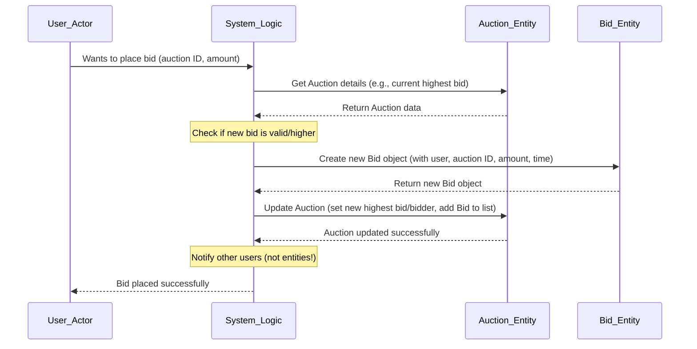

# Chapter 2: Entities (User, Auction, Bid)

Welcome back to the AuctionSystem tutorial! In the [previous chapter](01_user_session_management_.md), we learned how the system keeps track of *who* is currently logged in using sessions. Knowing who is interacting with the system is essential, but we also need to represent the main *things* they interact with.

Think about a real-world auction. What are the fundamental things involved? There are the **people** participating, the **items** being sold, and the **offers** (bids) placed on those items. Our Auction System needs a way to represent these core concepts digitally.

This is where the concept of **Entities** comes in. Entities are the foundational building blocks of our system. They are like blueprints for the main types of data we store and work with. They primarily hold information (data) and might have simple methods related to managing that data, but the complex business logic (like deciding if a bid is valid or managing the auction lifecycle) lives elsewhere (in the Services, which we'll cover in [Chapter 3: Service EJBs (Auction, Bid, User)](03_service_ejbs__auction__bid__user_.md)).

Let's look at the three main entities in our system: `User`, `Auction`, and `Bid`.

## The Core Concepts: Our Entities

Our system revolves around three primary types of data, each represented by a Java class:

1.  **`User`**: Represents a person using the system. This could be someone placing bids, someone selling items, or an administrator.
2.  **`Auction`**: Represents an item being sold. It holds all the details about the item, its current state in the auction process, and the offers made on it.
3.  **`Bid`**: Represents a specific offer of money made by a `User` on an `Auction`.

Let's explore each one in more detail.

### The `User` Entity

The `User` entity represents an individual account in the system. What information do we need to store about a user?

*   A unique **username** to identify them.
*   An **email address** for communication.
*   A secure way to store their **password**.
*   Information about their activity (like `lastActivity` time, though this is also linked to session management as seen in Chapter 1).
*   Whether the user is **active** or not.
*   Whether the user has **administrator** privileges.

The `User` class in our code (`src/main/java/com/auction/entity/User.java`) holds this information. Notice how it includes fields for all these pieces of data.

```java
// --- Snippet from src/main/java/com/auction/entity/User.java ---
package com.auction.entity;

import java.io.Serializable;
import java.time.LocalDateTime;
// ... imports for security (hashing) ...

public class User implements Serializable {
    private String username;
    private String email;
    private String passwordHash; // Store hashed password, NOT plain text!
    private LocalDateTime lastActivity;
    private boolean active;
    private boolean isAdmin;

    // ... Constructors ...

    // Simple method to hash a password for storage
    private String hashPassword(String password) {
        // ... implementation details for hashing (SHA-256) ...
        return "hashed_password_string"; // Example return
    }

    // Method to check if a provided password matches the stored hash
    public boolean verifyPassword(String password) {
        return passwordHash.equals(hashPassword(password));
    }

    // Method to update the password (hashes the new one)
    public void setPassword(String password) {
        this.passwordHash = hashPassword(password);
    }

    // ... Getters and Setters for all fields ...
}
```

**Explanation:**

*   The fields (`username`, `email`, `passwordHash`, etc.) are where the data is stored.
*   `passwordHash` is crucial for security – we never store the actual password, only a "hashed" version that's extremely difficult to reverse.
*   The `hashPassword` method takes a plain password and turns it into the hash.
*   The `verifyPassword` method takes a plain password typed by the user during login, hashes *that*, and compares the result to the stored `passwordHash`. If they match, the password is correct.
*   The `setPassword` method is used when a user creates their account or changes their password; it hashes the new password before storing it.
*   The `isAdmin` flag determines if this user has special administrative privileges.

This `User` entity provides the structured data we need to manage user accounts, handle logins securely, and control access based on roles (like admin).

### The `Auction` Entity

The `Auction` entity represents an item listed for sale in the system. What information is needed to describe an auction and track its progress?

*   A unique **auction ID**.
*   The **title** and **description** of the item.
*   The **starting price**.
*   The **current highest bid** and **who placed it**.
*   When the auction **starts** and **ends**.
*   Whether the auction is currently **active**.
*   Its overall **status** (active, ended, cancelled, expired).
*   Information about the outcome after it ends (winner, winning bid, reason for ending).
*   A way to track all the **bids** that have been placed on this auction.

Let's look at parts of the `Auction` class (`src/main/java/com/auction/entity/Auction.java`):

```java
// --- Snippet from src/main/java/com/auction/entity/Auction.java ---
package com.auction.entity;

import java.io.Serializable;
import java.time.LocalDateTime;
import java.util.concurrent.ConcurrentHashMap;
import java.util.concurrent.atomic.AtomicLong;

public class Auction implements Serializable {
    private Long auctionId;
    private String title;
    private String description;
    private double startingPrice;
    private double currentHighestBid;
    private String currentHighestBidder; // Username of the highest bidder
    private LocalDateTime startTime;
    private LocalDateTime endTime;
    private boolean active;

    // Fields for history/status
    private AuctionStatus status;
    private LocalDateTime completedTime;
    private String winnerUsername;
    private double winningBid;
    private String endReason;

    // Transient fields - not automatically saved/loaded with the rest
    private transient AtomicLong bidCounter;
    private transient ConcurrentHashMap<Long, Bid> bids; // Store bids for THIS auction

    public enum AuctionStatus {
        ACTIVE("Active"), ENDED("Ended"), CANCELLED("Cancelled"), EXPIRED("Expired");
        // ... display name logic ...
    }

    // ... Constructors ...

    // Initializes the transient fields (like bids map and counter)
    private void initializeTransientFields() {
       // ... logic to create maps and counters if they are null ...
    }

    // Method to mark the auction as completed
    public void completeAuction(String reason) {
       this.active = false;
       this.completedTime = LocalDateTime.now();
       this.endReason = reason;
       this.winnerUsername = this.currentHighestBidder;
       this.winningBid = this.currentHighestBid;
       // ... update status based on reason ...
    }

    // Method to get the bids placed on THIS auction
    public ConcurrentHashMap<Long, Bid> getBids() {
        if (bids == null) initializeTransientFields(); // Ensure map is ready
        return bids;
    }

    // ... Other Getters and Setters ...
}
```

**Explanation:**

*   Fields like `title`, `description`, `startingPrice`, `endTime` describe the item and the auction schedule.
*   `currentHighestBid` and `currentHighestBidder` track the current state of the bidding.
*   `active` is a simple flag indicating if bidding is currently open.
*   `status` uses an `enum` (`AuctionStatus`) to represent the auction's lifecycle stage (Active, Ended, etc.) more clearly than just a boolean.
*   Fields like `completedTime`, `winnerUsername`, `winningBid`, and `endReason` store the final outcome.
*   The `bids` field is a map that holds all the `Bid` entities related to *this specific* auction object when it is being processed in memory. It's marked `transient`, meaning it's not automatically saved/loaded, suggesting the system manages the saving and loading of Bids separately or constructs this map after loading the Auction data.
*   `initializeTransientFields` is a helper method to make sure the `bids` map and `bidCounter` are ready to use when the `Auction` object is loaded.
*   `completeAuction` is a method to update the auction's state when it finishes for any reason.

The `Auction` entity bundles all the data needed to display an auction listing, track its progress, and determine the result.

### The `Bid` Entity

The `Bid` entity represents a single offer made by a user on an auction. It's a simpler entity compared to `User` and `Auction`, mainly linking a user to an auction with an amount and time.

What information does a bid need?

*   A unique **bid ID**.
*   Which **auction** the bid was placed on.
*   Which **user** placed the bid.
*   The **amount** of the bid.
*   The **time** the bid was placed.
*   Whether this bid is currently the **winning bid** for the auction.

Here's the `Bid` class (`src/main/java/com/auction/entity/Bid.java`):

```java
// --- Snippet from src/main/java/com/auction/entity/Bid.java ---
package com.auction.entity;

import java.io.Serializable;
import java.time.LocalDateTime;

public class Bid implements Serializable {
    private Long bidId;
    private Long auctionId;         // Links to the Auction
    private String bidderUsername;  // Links to the User
    private double bidAmount;
    private LocalDateTime bidTime;
    private boolean isWinning;      // Is this currently the highest bid?

    // ... Constructor ...

    // ... Getters and Setters for all fields ...
}
```

**Explanation:**

*   `bidId` is the unique identifier for this specific bid.
*   `auctionId` and `bidderUsername` are the links back to the `Auction` and `User` entities. Notice they use IDs (`auctionId`) or unique identifiers (`bidderUsername`) rather than storing the full `Auction` or `User` objects directly within the `Bid` itself. This is a common way to represent relationships between entities.
*   `bidAmount` and `bidTime` record the offer details.
*   `isWinning` is a flag that gets updated by the system logic when a new, higher bid is placed or when this bid becomes the winner at the end of the auction.

The `Bid` entity captures the specific details of an offer, linking it back to the auction and the user who made it.

## How Entities Work Together (A Simple Example)

Let's imagine a user wants to place a bid on an auction. This involves interacting with our entities.



In this flow:
1.  The **User** *wants* to place a bid.
2.  The **System Logic** (which will be implemented in our Services in the next chapter) receives this request.
3.  The System Logic needs data from the **Auction Entity** to know the current highest bid.
4.  The System Logic decides if the new bid is valid and higher.
5.  If valid, the System Logic creates a new **Bid Entity** object with all the details.
6.  The System Logic then updates the **Auction Entity** object with the new highest bid and bidder, and adds the new Bid object to the auction's internal list of bids (the `bids` map we saw).

This diagram shows how the system logic uses these data objects to perform a core task. The entities themselves don't contain the complex *rules* for placing a bid (like "must be higher than current bid", "must be before end time"), but they hold all the *information* those rules need to operate on.

## Under the Hood: Simple Data Containers

As you saw in the code snippets, these entity classes are relatively simple. They mainly consist of:

*   **Fields:** Variables to hold the data (like `username`, `title`, `bidAmount`).
*   **Constructors:** Special methods to create new instances of the entity, often initializing the fields.
*   **Getters and Setters:** Standard methods (`getUsername()`, `setEmail(String email)`) that allow other parts of the code to safely read and update the entity's data.
*   **Simple Helper Methods:** Like `verifyPassword` or `completeAuction` that perform operations directly related to managing the entity's internal state, but not complex business processes.
*   **`Serializable` Interface:** This is important. Implementing `Serializable` (as seen in the class declarations) means that objects of these classes can be easily converted into a stream of bytes and sent across a network or saved to a file. This is crucial in distributed systems like Java EE applications where data needs to be moved between different components (like from a database to a Service EJB, or from an EJB to a Servlet).
*   **`transient` Keyword:** In the `Auction` class, fields like `bidCounter` and `bids` are marked `transient`. This tells the Java serialization mechanism *not* to include these fields when saving or sending the object. This is often done for fields that are re-calculated, rebuilt from other data, or only relevant while the object is actively in memory (like a helper map for quick lookups).

The beauty of keeping entities focused on data is that they are easy to understand and manage. The complex logic that *uses* this data is separated elsewhere, making the system more organized.

## Summary

In this chapter, we've introduced the fundamental data structures of our AuctionSystem:

*   The `User` entity, which represents individuals and their account details, including secure password handling.
*   The `Auction` entity, which holds all the information about an item being sold, its state, and outcome.
*   The `Bid` entity, which captures the details of a specific offer made by a user on an auction.

These entities act as containers for the crucial data that flows through the system. They hold the "what" – the information – allowing other components to focus on the "how" – the business rules and processes.

Now that we understand the basic building blocks of our data, we're ready to look at the components that actually *perform* the actions in our auction system, like placing bids, creating auctions, and managing users.

[Next Chapter: Service EJBs (Auction, Bid, User)](03_service_ejbs__auction__bid__user_.md)

---
