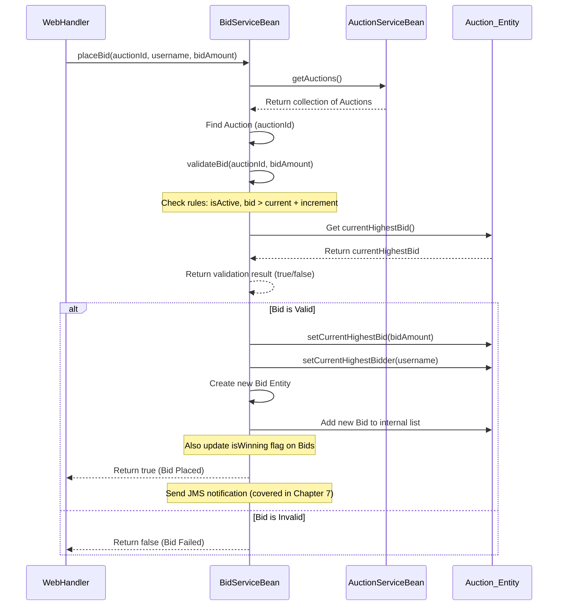

# Chapter 3: Service EJBs (Auction, Bid, User)

Welcome back to the AuctionSystem tutorial! In the [previous chapter](02_entities__user__auction__bid_.md), we learned about our core data structures: the `User`, `Auction`, and `Bid` entities. These entities are like the "nouns" of our system – they represent the important *things* we need to keep track of.

But an auction system isn't just about static data; it's about *doing* things! Users need to register, log in, create auctions, and place bids. Auctions need to start, receive bids, and eventually end. This is where the "verbs" of our system come in, and in our project, these actions and the rules that govern them are handled by **Service EJBs**.

Think of Service EJBs as the **expert agents** or **workforce** of our application. While entities hold the data (the *what*), services contain the logic (the *how*) to perform operations *on* that data and enforce the rules.

Let's consider a core task: **Placing a bid**.

A user wants to place a bid on a specific auction. This simple action isn't just about changing a number on a database. It involves several steps and rules:

1.  Is the user logged in and valid? (Relates to `User` and [Chapter 1: User Session Management](01_user_session_management_.md))
2.  Does the target auction exist?
3.  Is the auction currently active and open for bids?
4.  Is the *amount* the user wants to bid valid? (e.g., Is it higher than the current highest bid? Is it at least the minimum required increase?)
5.  If the bid is valid, update the auction's record: the highest bid, the highest bidder.
6.  Record the specific bid itself (who, how much, when).
7.  Notify other users that a new bid has been placed.

All these steps, checks, and updates involve complex logic that doesn't belong inside the simple `Bid` or `Auction` entity classes. This logic lives in our Service EJBs.

## Key Concepts: Our Expert Agents

Our `AuctionSystem` uses three main Service EJBs, each specializing in managing operations related to one of our core entities:

*   **`UserService`**: This agent is an expert in user accounts. It handles registration, login, password changes, finding users, and checking if a user is an administrator.
*   **`AuctionService`**: This agent knows everything about managing auctions. It creates new auctions, retrieves auction details, lists active or completed auctions, and handles closing or cancelling auctions.
*   **`BidService`**: This agent specializes in bids. It receives requests to place bids, validates the bid amount against auction rules, records the bid, updates the auction record, and can provide lists of bids for an auction.

These services often need to work together. For example, when placing a bid (`BidService`), the service needs information from the corresponding `Auction` (managed by `AuctionService`) to validate the bid, and it might need user information (managed by `UserService`) to verify the bidder.

## Using the Service EJBs (The "What They Do")

Other parts of the application, like web pages (Servlets) or background processes, don't directly mess with the entity data. Instead, they ask the appropriate Service EJB to perform the required action. They interact with the services through their **Remote Interfaces**.

Here are the interfaces that define the capabilities of each service:

```java
// --- Snippet from src/main/java/com/auction/ejb/UserServiceRemote.java ---
package com.auction.ejb;

import com.auction.entity.User;
import jakarta.ejb.Remote;
import java.util.List;

@Remote // This annotation makes it accessible from other components
public interface UserServiceRemote {
    User registerUser(String username, String email, String password);
    User getUserByUsername(String username);
    boolean authenticateUser(String username, String password);
    boolean isUserAdmin(String username);
    List<User> getAllActiveUsers();
    // ... other user-related methods ...
    boolean changePassword(String username, String oldPassword, String newPassword);
}
```
This `UserServiceRemote` interface lists everything you can ask the `UserService` to do, like registering a user, logging them in (`authenticateUser`), or checking their admin status (`isUserAdmin`).

```java
// --- Snippet from src/main/java/com/auction/ejb/AuctionServiceRemote.java ---
package com.auction.ejb;

import com.auction.dto.AuctionDTO; // Services often return DTOs (Data Transfer Objects)
import jakarta.ejb.Remote;
import java.time.LocalDateTime;
import java.util.List;

@Remote
public interface AuctionServiceRemote {
    AuctionDTO createAuction(String title, String description, double startingPrice, LocalDateTime endTime);
    AuctionDTO getAuction(Long auctionId);
    List<AuctionDTO> getAllActiveAuctions();
    boolean closeAuction(Long auctionId);
    // ... other auction-related methods ...
    boolean validateAuctionDuration(int hours, int minutes);
}
```
The `AuctionServiceRemote` interface shows methods for creating auctions, getting auction details (`getAuction`), listing auctions (`getAllActiveAuctions`), and closing them (`closeAuction`). Notice it returns `AuctionDTO` objects – these are simplified versions of the `Auction` entity, often used to send data to the user interface without exposing all internal details.

```java
// --- Snippet from src/main/java/com/auction/ejb/BidServiceRemote.java ---
package com.auction.ejb;

import com.auction.entity.Bid;
import jakarta.ejb.Remote;
import java.io.Serializable; // Sometimes methods return Serializable data
import java.util.List;

@Remote
public interface BidServiceRemote {
    boolean placeBid(Long auctionId, String username, double bidAmount);
    List<Bid> getBidsForAuction(Long auctionId);
    Serializable getHighestBid(Long auctionId); // Returns the highest bid object
    boolean validateBid(Long auctionId, double bidAmount);
    // ... other bid-related methods ...
}
```
The `BidServiceRemote` interface lists the core bidding actions, most importantly `placeBid`, but also methods to check if a bid is valid (`validateBid`) or get the current highest bid (`getHighestBid`).

Let's see simple examples of how another part of the application (like a web page handler) might use these:

**Example 1: Handling User Login**

```java
// Example: Inside a Login Servlet (conceptual)
// After getting username/password from user input...

// Get a reference to the UserService
// (Java EE provides ways to 'inject' this automatically)
// @EJB private UserServiceRemote userService;

boolean success = userService.authenticateUser(username, password);

if (success) {
    // User is authenticated!
    // Now create a session using the UserSessionManager (from Chapter 1)
    // @EJB private UserSessionManagerRemote sessionManager;
    // String sessionToken = sessionManager.createUserSession(...);
    // ... then redirect to a logged-in page
} else {
    // Authentication failed. Show error message.
}
```
Here, the Login handler doesn't look up the user or check the password hash itself. It simply calls `userService.authenticateUser` and trusts the `UserService` to handle the complex authentication logic.

**Example 2: Displaying Active Auctions**

```java
// Example: Inside a Servlet showing the auction list (conceptual)

// Get a reference to the AuctionService
// @EJB private AuctionServiceRemote auctionService;

List<AuctionDTO> activeAuctions = auctionService.getAllActiveAuctions();

// ... pass the list of activeAuctions to a web page template to display them ...
```
To show the list of active auctions, the code just asks the `AuctionService` for the list. It doesn't need to know *how* the service finds active auctions or how it stores them.

**Example 3: Handling a "Place Bid" Request**

```java
// Example: Inside a Servlet handling bid submission (conceptual)
// Get auctionId, bidAmount from user input, and username from session

// Get a reference to the BidService
// @EJB private BidServiceRemote bidService;

boolean bidPlaced = bidService.placeBid(auctionId, username, bidAmount);

if (bidPlaced) {
    // Bid was successful! Redirect to auction page with success message.
} else {
    // Bid failed (e.g., amount too low, auction ended). Redirect with error message.
}
```
This is the most complex example from earlier. The code handling the user's request doesn't implement the bid validation rules or the logic to update the auction. It just calls `bidService.placeBid` and lets the `BidService` take care of everything, including interacting with the necessary `Auction` entity and potentially other services.

This shows the power of services: they hide the complexity and provide a clean interface for other parts of the application to perform specific tasks.

## Under the Hood: Implementation Details (The "How They Work")

Now, let's peek inside the actual implementation classes (`UserServiceBean`, `AuctionServiceBean`, `BidServiceBean`) to see how these services perform their jobs.

These classes are marked with Java EE annotations like `@Stateless` or `@Stateful`, indicating they are EJBs. The server manages these components, creating instances as needed.

*   `@Stateless`: EJBs that don't hold client-specific data between method calls (like `AuctionServiceBean`, `BidServiceBean`). They are efficient because the server can reuse instances.
*   `@Stateful`: EJBs that *do* hold client-specific data (like `UserServiceBean` which remembers the `currentUsername` for that session, though in a more traditional design this might be managed differently). The server maintains a dedicated instance for a specific client session.

Here's a simplified sequence diagram for the "Place Bid" scenario, showing the interaction between the services:



As you can see, the `BidServiceBean` orchestrates the process. It needs to get the `Auction` data (by asking `AuctionServiceBean`'s shared storage), performs validation, and then directly interacts with the `Auction` entity object to update its state and add the new `Bid` entity object.

Let's look at small pieces of the implementation to see the logic:

**`UserServiceBean.authenticateUser`:**

```java
// --- Snippet from src/main/java/com/auction/ejb/UserServiceBean.java ---
@Override
public boolean authenticateUser(String username, String password) {
    logger.info("Authenticating user: " + username);
    if (username == null || password == null) {
        return false; // Basic validation
    }
    User user = users.get(username); // Get user entity from storage (ConcurrentHashMap)
    if (user != null && user.isActive() && user.verifyPassword(password)) {
        this.currentUsername = username; // Stateful bean remembers user
        updateUserActivity(username); // Update activity timestamp
        logger.info("User authenticated successfully: " + username);
        return true;
    }
    logger.warning("Authentication failed for user: " + username);
    return false;
}
```
This method gets the `User` entity from its internal `users` map (our simple in-memory storage for this example, which would be a database in a real app). It then uses the `isActive()` and `verifyPassword()` methods *on the User entity* to check credentials and status. It relies on the entity to handle the password verification (`verifyPassword` explained in [Chapter 2](02_entities__user__user__auction__bid_.md)).

**`BidServiceBean.validateBid`:**

```java
// --- Snippet from src/main/java/com/auction/ejb/BidServiceBean.java ---
private static final double MIN_BID_INCREMENT = 5.0;

@Override
public boolean validateBid(Long auctionId, double bidAmount) {
    // Get auction from AuctionServiceBean's storage (Accessing static data)
    ConcurrentHashMap<Long, Auction> auctions = AuctionServiceBean.getAuctions();
    Auction auction = auctions.get(auctionId);

    if (auction == null) {
        return false; // Auction doesn't exist
    }

    // Business rule: Bid must be higher than current highest bid + minimum increment
    return bidAmount > auction.getCurrentHighestBid() + MIN_BID_INCREMENT;
}
```
This shows a core business rule being enforced. The `BidService` retrieves the `Auction` entity (by accessing the shared storage managed by `AuctionServiceBean` - note the static access `AuctionServiceBean.getAuctions()`, which is a simplification for this example). It then checks if the `bidAmount` meets the minimum requirement compared to the `Auction` entity's `currentHighestBid`.

**`AuctionServiceBean.closeAuction`:**

```java
// --- Snippet from src/main/java/com/auction/ejb/AuctionServiceBean.java ---
@Override
public boolean closeAuction(Long auctionId, String reason) {
    logger.info("Closing auction with ID: " + auctionId + ", reason: " + reason);

    Auction auction = auctions.get(auctionId); // Get auction entity from storage
    if (auction != null && auction.isActive()) {
        // Use the entity's method to update its own state
        auction.completeAuction(reason);
        logger.info("Auction " + auctionId + " closed successfully. Winner: " +
                auction.getWinnerUsername() + ", Final bid: $" + auction.getWinningBid());
        return true;
    }
    return false; // Auction not found or not active
}
```
Here, the `AuctionService` retrieves the `Auction` entity and then calls the `completeAuction` method *on the entity itself* to update its status. This keeps the entity responsible for managing its own simple state changes (`isActive = false`, set winner, etc.), while the service controls the overall process of *when* and *why* to call that method.

Notice how the services use the data from the entities, perform checks based on business rules, and then update the entities. They are the bridge between the raw data and the actions users want to perform.

For persistence in this example application, the services use simple static `ConcurrentHashMap` objects (`users` in `UserServiceBean` and `auctions` in `AuctionServiceBean`). In a real-world Java EE application, these services would typically interact with a database using technologies like JPA (Java Persistence API), but the principle remains the same: the service contains the business logic and uses other components (like entity managers for databases) to manipulate the data held by the entities.

## Summary

In this chapter, we've explored the crucial role of Service EJBs in our AuctionSystem:

*   They are the **workhorses** that contain the main business logic and perform actions.
*   `UserService` manages user accounts, registration, and authentication.
*   `AuctionService` manages the lifecycle and details of auctions.
*   `BidService` handles bid placement and validation.
*   Other parts of the application interact with these services through their **Remote Interfaces**, allowing them to perform tasks without needing to know the internal implementation details or directly manipulate entities.
*   We saw how the "Place Bid" use case involves coordination between `BidService` and `AuctionService`, demonstrating how services work together and interact with the `Auction` and `Bid` entities.
*   We briefly touched upon the `@Stateless` and `@Stateful` nature of EJBs and how the services use entity methods and enforce business rules.

These services form the core engine of our application, performing all the necessary operations based on the rules of our auction system.

Now that we understand the core data (Entities) and the core logic (Services), how do we control access to these services and manage overall request handling? That's where Filters come in.

[Next Chapter: Filters (Session, Admin, Encoding)](04_filters__session__admin__encoding_.md)

---
