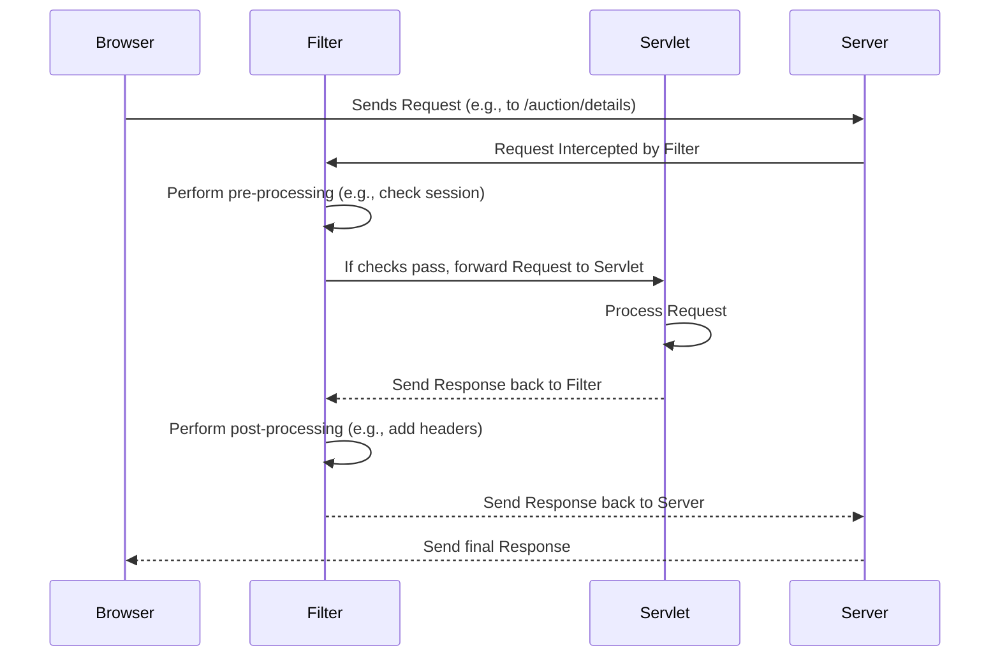
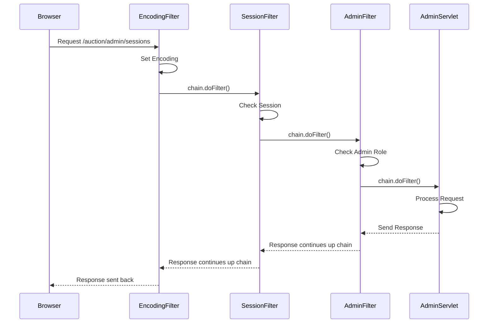

# Chapter 4: Filters (Session, Admin, Encoding)

Welcome back to the AuctionSystem tutorial! In the [previous chapter](03_service_ejbs__auction__bid__user_.md), we explored our **Service EJBs**, the expert agents (`UserService`, `AuctionService`, `BidService`) that handle the core business logic and operations using our **Entities** (`User`, `Auction`, `Bid`) as data ([Chapter 2](02_entities__user__auction__bid__.md)). We also saw how sessions are managed to know *who* is logged in ([Chapter 1](01_user_session_management_.md)).

Now, imagine a request comes into our web application from a user's browser. Before this request reaches the code that's supposed to handle it (like a Servlet that displays auction details or processes a bid), we often need to perform some preliminary checks or tasks.

For example:
*   Is this request coming from a logged-in user if it's for a page that requires authentication?
*   Is this request from an *administrator* if it's for a special admin-only page?
*   Is the data in the request being handled correctly, like ensuring characters from different languages are interpreted properly?

Repeating these checks in every single Servlet or request handler would be tedious and error-prone. This is where **Filters** come in.

## What are Filters? The Checkpoints

Filters are components that sit in between the user's browser and the resource (like a Servlet or JSP page) they are trying to access on the server. They intercept incoming requests *before* they reach the target resource and outgoing responses *after* the resource has processed the request but *before* the response is sent back to the browser.

Think of filters as **checkpoints or gatekeepers** that every request must pass through (or potentially several checkpoints in sequence).

Here's a simple visualization of how a filter works:



Filters can perform various tasks:
*   **Authentication/Authorization:** Check if a user is logged in (`SessionFilter`) or has specific permissions (`AdminFilter`).
*   **Logging:** Record details about incoming requests.
*   **Data Manipulation:** Modify request parameters or headers.
*   **Encoding:** Ensure character sets are handled correctly (`CharacterEncodingFilter`).
*   **Compression:** Compress response data.
*   **Security Headers:** Add important security headers to responses.

In our `AuctionSystem`, we use filters primarily for session validation, admin access control, and character encoding.

## Key Filter Concepts

1.  **`Filter` Interface:** This is a standard Java interface that any class wanting to be a filter must implement. It defines the core methods: `init`, `doFilter`, and `destroy`.
2.  **`doFilter` Method:** This is the heart of the filter. It takes the incoming `ServletRequest` and `ServletResponse`, and a `FilterChain`. Inside this method, you perform your pre-processing logic. Crucially, you then call `chain.doFilter(request, response)` to pass the request *down the chain* (either to the next filter or the final resource). After this call returns, you can perform post-processing logic before the method finishes.
3.  **`FilterChain`:** Represents the sequence of filters the request must pass through, followed by the target resource. Calling `chain.doFilter()` tells the server to proceed to the next component in the chain.
4.  **Configuration (`web.xml` or `@WebFilter`):** Filters aren't just automatically applied. You need to tell the web server which filter class to use and for which URL patterns it should intercept requests. This is done either in the `WEB-INF/web.xml` deployment descriptor file or using the `@WebFilter` annotation directly on the filter class.

## How to Use Filters (Configuration)

You don't typically "call" a filter from your other code (like Servlets or EJBs). You simply configure them, and the web server automatically applies them based on the incoming request URL.

Here's how filters are configured in the `WEB-INF/web.xml` file for our project (you saw a snippet of this in Chapter 1):

```xml
<!-- Snippet from src/main/webapp/WEB-INF/web.xml -->
    <!-- Filters -->
    <filter>
        <filter-name>CharacterEncodingFilter</filter-name>
        <filter-class>com.auction.filter.CharacterEncodingFilter</filter-class>
        <init-param>
            <param-name>encoding</param-name>
            <param-value>UTF-8</param-value>
        </init-param>
    </filter>

    <filter-mapping>
        <filter-name>CharacterEncodingFilter</filter-name>
        <url-pattern>/*</url-pattern> <!-- Apply to ALL requests -->
    </filter-mapping>

    <!-- Other filters would be configured here too -->
    <!-- For example:
    <filter>
        <filter-name>SessionFilter</filter-name>
        <filter-class>com.auction.filter.SessionFilter</filter-class>
    </filter>
    <filter-mapping>
        <filter-name>SessionFilter</filter-name>
        <url-pattern>/auction/*</url-pattern>
    </filter-mapping>
    -->

    <!-- ... rest of web.xml ... -->
```

In this example:
*   The `<filter>` tag defines a filter, giving it a name (`CharacterEncodingFilter`) and specifying the Java class that implements the filter logic (`com.auction.filter.CharacterEncodingFilter`). It can also have initialization parameters (`<init-param>`).
*   The `<filter-mapping>` tag links a defined filter name (`CharacterEncodingFilter`) to a URL pattern (`/*`). The `/*` pattern means this filter will be applied to *every* request coming into the application. Other patterns like `/auction/*` would apply the filter only to URLs starting with `/auction/`.

Alternatively, you can use the `@WebFilter` annotation directly on the filter class, as done in our code:

```java
// Example: Directly on a Filter class
package com.auction.filter;
import jakarta.servlet.annotation.WebFilter;

@WebFilter(urlPatterns = {"/*"}) // Apply to all URLs
public class CharacterEncodingFilter implements Filter {
    // ... filter implementation ...
}

@WebFilter(urlPatterns = {"/auction/*"}) // Apply to URLs under /auction/
public class SessionFilter implements Filter {
    // ... filter implementation ...
}

@WebFilter(urlPatterns = {"/auction/admin/*"}) // Apply to URLs under /auction/admin/
public class AdminFilter implements Filter {
    // ... filter implementation ...
}
```
This achieves the same result as the `web.xml` configuration but keeps the filter configuration close to the code.

Now, let's look at the specific filters in our system.

## CharacterEncodingFilter: Speaking the Same Language

When data is sent over the web (like form submissions or data in URLs), it's represented as bytes. How these bytes are translated back into characters depends on the **character encoding**. If the server and browser use different encodings, you might see weird symbols instead of the correct text (like `` instead of `é`).

The `CharacterEncodingFilter` ensures that the server consistently interprets incoming request data and formats outgoing response data using a specific encoding, typically UTF-8, which supports a wide range of characters.

**How it works:** This filter is mapped to `/*`, meaning it intercepts *every* request. It sets the character encoding on the request and response objects before passing them down the chain.

```java
// Snippet from src/main/java/com/auction/filter/CharacterEncodingFilter.java
package com.auction.filter;
import jakarta.servlet.*;
import jakarta.servlet.annotation.WebFilter;
import jakarta.servlet.http.HttpServletRequest;
import jakarta.servlet.http.HttpServletResponse;
import java.io.IOException;

@WebFilter(filterName = "CharacterEncodingFilter", urlPatterns = {"/*"})
public class CharacterEncodingFilter implements Filter {

    private String encoding = "UTF-8"; // Default encoding

    @Override
    public void init(FilterConfig filterConfig) throws ServletException {
        // Read encoding from web.xml init-param if available
        String encodingParam = filterConfig.getInitParameter("encoding");
        if (encodingParam != null && !encodingParam.trim().isEmpty()) {
            this.encoding = encodingParam;
        }
    }

    @Override
    public void doFilter(ServletRequest request, ServletResponse response,
                         FilterChain chain) throws IOException, ServletException {

        // Set request encoding if not already set
        if (request.getCharacterEncoding() == null) {
            request.setCharacterEncoding(encoding);
        }

        // Set response encoding and content type header
        response.setCharacterEncoding(encoding);
        HttpServletResponse httpResponse = (HttpServletResponse) response;
        httpResponse.setHeader("Content-Type", "text/html; charset=" + encoding);

        // Add some basic security headers (not related to encoding but often added here)
        httpResponse.setHeader("X-Content-Type-Options", "nosniff");
        httpResponse.setHeader("X-Frame-Options", "DENY");
        httpResponse.setHeader("X-XSS-Protection", "1; mode=block");

        // Continue processing the request/response chain
        chain.doFilter(request, response);
    }

    @Override
    public void destroy() {
        // Cleanup logic if needed (none needed here)
    }
}
```
*   `init`: Reads the desired encoding from the configuration (either `web.xml` or `@WebFilter` annotation parameters, though `@WebFilter` params aren't shown in this snippet, `web.xml` is used).
*   `doFilter`: This is called for every request.
    *   `request.setCharacterEncoding(encoding)`: Tells the server to interpret data in the request body (like form data) using the specified encoding.
    *   `response.setCharacterEncoding(encoding)` and `httpResponse.setHeader("Content-Type", ...)`: Tells the browser what encoding the response body is using, so the browser can display it correctly.
    *   Security headers: Adds extra security headers, a common place to put them as this filter runs early.
    *   `chain.doFilter(request, response)`: This is vital! It passes the request along to the next filter in the chain or to the final destination (like a Servlet).

**Analogy:** This filter is like a universal translator at the entrance of our system, ensuring that no matter how data is sent in, it's always understood and processed using a standard character set (UTF-8), and that our responses are labeled correctly so browsers can read them.

## SessionFilter: Checking Your Membership Card

As we saw in [Chapter 1](01_user_session_management_.md), many pages and actions in our system should only be available to users who are logged in. The `SessionFilter` is the gatekeeper for these protected areas.

**How it works:** This filter is mapped to specific URL patterns that require a logged-in user (e.g., `/auction/*`, excluding login/register pages). It retrieves the session token (usually stored in the standard `HttpSession` after successful login) and uses the `UserSessionManager` ([Chapter 1](01_user_session_management_.md)) to check if the token is valid and active. If not, it stops the request and redirects the user to the login page.

```java
// Snippet from src/main/java/com/auction/filter/SessionFilter.java
package com.auction.filter;

import com.auction.session.UserSessionManagerRemote; // Our EJB from Chapter 1
import jakarta.ejb.EJB;
import jakarta.servlet.*;
import jakarta.servlet.annotation.WebFilter;
import jakarta.servlet.http.HttpServletRequest;
import jakarta.servlet.http.HttpServletResponse;
import jakarta.servlet.http.HttpSession;
import java.io.IOException;
import java.util.logging.Logger;

@WebFilter(urlPatterns = {"/auction/*"}) // Apply to URLs under /auction/
public class SessionFilter implements Filter {

    private static final Logger logger = Logger.getLogger(SessionFilter.class.getName());

    @EJB // Inject the UserSessionManager EJB from Chapter 1
    private UserSessionManagerRemote sessionManager;

    @Override
    public void doFilter(ServletRequest request, ServletResponse response, FilterChain chain)
            throws IOException, ServletException {

        HttpServletRequest httpRequest = (HttpServletRequest) request;
        HttpServletResponse httpResponse = (HttpServletResponse) response;
        String requestURI = httpRequest.getRequestURI();

        // Define URLs that *don't* require a session (login, register, static files)
        if (shouldSkipFilter(requestURI)) {
            chain.doFilter(request, response); // Let these requests through immediately
            return;
        }

        HttpSession httpSession = httpRequest.getSession(false); // Get existing session if it exists
        String sessionToken = null;

        if (httpSession != null) {
            // Get the session token stored during login (see Chapter 1)
            sessionToken = (String) httpSession.getAttribute("sessionToken");
        }

        // Check if we have a token and if the Session Manager says it's valid
        if (sessionToken != null && sessionManager.isSessionValid(sessionToken)) {
            // Session is valid! Update its last activity time
            sessionManager.updateSessionActivity(sessionToken);

            // Optional: Perform security validation (IP/User-Agent match)
            String ipAddress = getClientIpAddress(httpRequest); // Helper method
            String userAgent = httpRequest.getHeader("User-Agent");
            if (!sessionManager.validateSessionSecurity(sessionToken, ipAddress, userAgent)) {
                 logger.warning("Session security validation failed");
                 sessionManager.invalidateSession(sessionToken); // Invalidate the session
                 redirectToLogin(httpResponse); // Redirect to login
                 return; // Stop processing
            }

            // If session is valid and security checks pass, continue
            chain.doFilter(request, response);

        } else {
            // No token, or token is invalid/expired
            logger.warning("Session invalid or expired. Redirecting to login.");
            if (httpSession != null) {
                httpSession.invalidate(); // Clean up any invalid server-side session object
            }
            redirectToLogin(httpResponse); // Redirect to login page
        }
    }

    // Helper method to check if a URL should bypass the filter
    private boolean shouldSkipFilter(String requestURI) {
        return requestURI.endsWith("/login") ||
               requestURI.endsWith("/register") ||
               requestURI.contains("/css/") ||
               requestURI.contains("/js/") ||
               requestURI.contains("/images/") ||
               requestURI.endsWith("/status") ||
               requestURI.equals("/AuctionSystem/auction/"); // Allow base URL
    }

    // Helper method to redirect
    private void redirectToLogin(HttpServletResponse response) throws IOException {
        response.sendRedirect("/AuctionSystem/auction/?error=session_expired");
    }

    // Helper method to get client IP (implementation details omitted)
    private String getClientIpAddress(HttpServletRequest request) {
       // ... simplified IP retrieval logic ...
       return "client_ip"; // Example
    }
}
```
*   `@WebFilter`: Configures this filter to run for all requests under `/auction/`.
*   `@EJB`: Injects our `UserSessionManagerRemote` EJB from [Chapter 1](01_user_session_management_.md), so the filter can use its methods.
*   `shouldSkipFilter`: A helper method to define exceptions (like the login page itself!) that don't require a session check.
*   `httpRequest.getSession(false)`: Gets the existing `HttpSession` if one exists. `false` means don't create a new one if it doesn't exist.
*   `httpSession.getAttribute("sessionToken")`: Retrieves the token we stored in [Chapter 1](01_user_session_management_.md) after successful login.
*   `sessionManager.isSessionValid(sessionToken)`: Calls our EJB to verify the token. This is the core check.
*   `sessionManager.updateSessionActivity`: Keeps the session alive by updating the last active time.
*   `sessionManager.validateSessionSecurity`: Performs optional checks (like IP address).
*   If valid, `chain.doFilter(request, response)` lets the request proceed.
*   If invalid, `httpSession.invalidate()` cleans up and `redirectToLogin` sends the user to the login page.

**Analogy:** This filter is like the bouncer at the entrance of a private club. It checks your membership card (session token) using a master list (`UserSessionManager`). If your card is valid, it lets you in (calls `chain.doFilter`); otherwise, it turns you away (redirects you).

## AdminFilter: Checking Your VIP Badge

Some parts of an application are restricted even further – only administrators should access them. The `AdminFilter` handles this layer of authorization.

**How it works:** This filter is mapped to URL patterns specifically for admin functions (e.g., `/auction/admin/*`). It first checks if the user *is* logged in (often relying on the `SessionFilter` having already run, but re-checking here is safer or the filters can be ordered) and then uses the `UserService` ([Chapter 3](03_service_ejbs__auction__bid__user_.md)) to check if the logged-in user has admin privileges.

```java
// Snippet from src/main/java/com/auction/filter/AdminFilter.java
package com.auction.filter;

import com.auction.session.UserSessionManagerRemote; // Our EJB from Chapter 1
import com.auction.ejb.UserServiceRemote;         // Our EJB from Chapter 3
import jakarta.ejb.EJB;
import jakarta.servlet.*;
import jakarta.servlet.annotation.WebFilter;
import jakarta.servlet.http.HttpServletRequest;
import jakarta.servlet.http.HttpServletResponse;
import jakarta.servlet.http.HttpSession;
import java.io.IOException;
import java.util.logging.Logger;

@WebFilter(urlPatterns = {"/auction/admin/*"}) // Apply ONLY to admin URLs
public class AdminFilter implements Filter {

    private static final Logger logger = Logger.getLogger(AdminFilter.class.getName());

    @EJB // Inject the Session Manager EJB
    private UserSessionManagerRemote sessionManager;

    @EJB // Inject the User Service EJB
    private UserServiceRemote userService;

    @Override
    public void doFilter(ServletRequest request, ServletResponse response, FilterChain chain)
            throws IOException, ServletException {

        HttpServletRequest httpRequest = (HttpServletRequest) request;
        HttpServletResponse httpResponse = (HttpServletResponse) response;

        HttpSession httpSession = httpRequest.getSession(false);
        String sessionToken = null;
        String username = null;

        if (httpSession != null) {
            sessionToken = (String) httpSession.getAttribute("sessionToken");
            username = (String) httpSession.getAttribute("username"); // Need username to check admin status
        }

        // 1. Check if they have a valid session token AND username
        if (sessionToken != null && sessionManager.isSessionValid(sessionToken) && username != null) {

            // 2. If logged in, check if the user is an administrator
            if (userService.isUserAdmin(username)) {
                // User is logged in AND is admin. Update activity and proceed.
                sessionManager.updateSessionActivity(sessionToken);
                chain.doFilter(request, response); // Let the request go to the admin resource
                return; // Stop processing filters
            } else {
                // User is logged in but NOT admin. Deny access.
                logger.warning("Non-admin user attempted admin access: " + username);
                httpResponse.sendRedirect("/AuctionSystem/auction/?error=access_denied"); // Redirect to a general error page
                return; // Stop processing filters
            }
        }

        // If we got here, they are not logged in or their session is invalid/expired
        logger.warning("Unauthorized access attempt to admin panel (not logged in)");
        httpResponse.sendRedirect("/AuctionSystem/auction/?error=admin_login_required"); // Redirect to login with specific message
    }
}
```
*   `@WebFilter`: Configures this filter to run *only* for requests under `/auction/admin/`.
*   `@EJB`: Injects `UserSessionManagerRemote` (from [Chapter 1](01_user_session_management_.md)) and `UserServiceRemote` (from [Chapter 3](03_service_ejbs__auction__bid__user_.md)).
*   Retrieves `sessionToken` and `username` from the `HttpSession`. The username is needed to ask the `UserService` about the user's role.
*   `sessionManager.isSessionValid(sessionToken)`: Checks if the session is valid (could also rely on `SessionFilter` running first, but belts and suspenders!).
*   `userService.isUserAdmin(username)`: Calls our `UserService` EJB to check the `isAdmin` flag on the `User` entity ([Chapter 2](02_entities__user__auction__bid__.md)) corresponding to the username.
*   If both checks pass, `chain.doFilter` lets the request go to the admin-specific Servlet or resource.
*   If the session is invalid OR the user is not an admin, the request is stopped, and the user is redirected.

**Analogy:** If the `SessionFilter` is the first bouncer checking for a membership card, the `AdminFilter` is a *second* bouncer at a special VIP section within the club. It checks not only if you have a valid membership card (`sessionToken`) but *also* if you have the special "Admin" badge (`userService.isUserAdmin`). If you don't have both, you're not allowed into the VIP area.

## The Filter Chain: Working Together

When you configure multiple filters for overlapping URL patterns, the web server arranges them into a **chain**. A request passes through filters in the order they are defined (in `web.xml`) or potentially based on ordering annotations (though simpler applications often rely on definition order or just careful URL pattern mapping).

When a filter calls `chain.doFilter()`, it's telling the server to execute the *next* component in the chain. This could be another filter or the final target resource.

Consider a request for `/auction/admin/sessions`.
1.  `CharacterEncodingFilter` intercepts (`/*`). Sets encoding. Calls `chain.doFilter()`.
2.  `SessionFilter` intercepts (`/auction/*`). Checks session validity. Calls `chain.doFilter()`.
3.  `AdminFilter` intercepts (`/auction/admin/*`). Checks admin status. Calls `chain.doFilter()`.
4.  The target resource (e.g., `SessionAdminServlet`) receives the request. Processes it.
5.  The target resource finishes and its response goes *backwards* through the chain, passing through the `doFilter` methods of the filters again (after the `chain.doFilter()` call returns). Filters can add post-processing here (like adding headers).


This chain ensures that multiple checks and processing steps are applied systematically to requests and responses before the final data reaches the user.

## Summary

In this chapter, we learned about **Filters**, components that intercept web requests and responses:

*   They act as **checkpoints** or **gatekeepers** in the request processing pipeline.
*   They are configured to apply to specific URL patterns using `web.xml` or `@WebFilter` annotations.
*   The `doFilter` method is where the pre- and post-processing logic lives, using `chain.doFilter()` to pass the request along.
*   We looked at three key filters in our system:
    *   `CharacterEncodingFilter`: Ensures consistent character handling (like UTF-8) for all requests and responses.
    *   `SessionFilter`: Protects URLs by verifying that the request comes from a valid, active user session using the `UserSessionManager` ([Chapter 1](01_user_session_management_.md)).
    *   `AdminFilter`: Adds an extra layer of protection for admin-specific URLs, checking if the logged-in user has administrator privileges using the `UserService` ([Chapter 3](03_service_ejbs__auction__bid__user_.md)).
*   Requests can pass through a **chain** of multiple filters before reaching their final destination.

Filters provide a powerful and centralized way to handle cross-cutting concerns like security, encoding, and logging, keeping this logic out of our Servlets and Service EJBs.

Now that we understand how requests are controlled and filtered, let's look at a special type of EJB that manages shared resources or application-wide state – the Singleton.

[Next Chapter: AuctionManagerSingleton](05_auctionmanagersingleton_.md)

---
