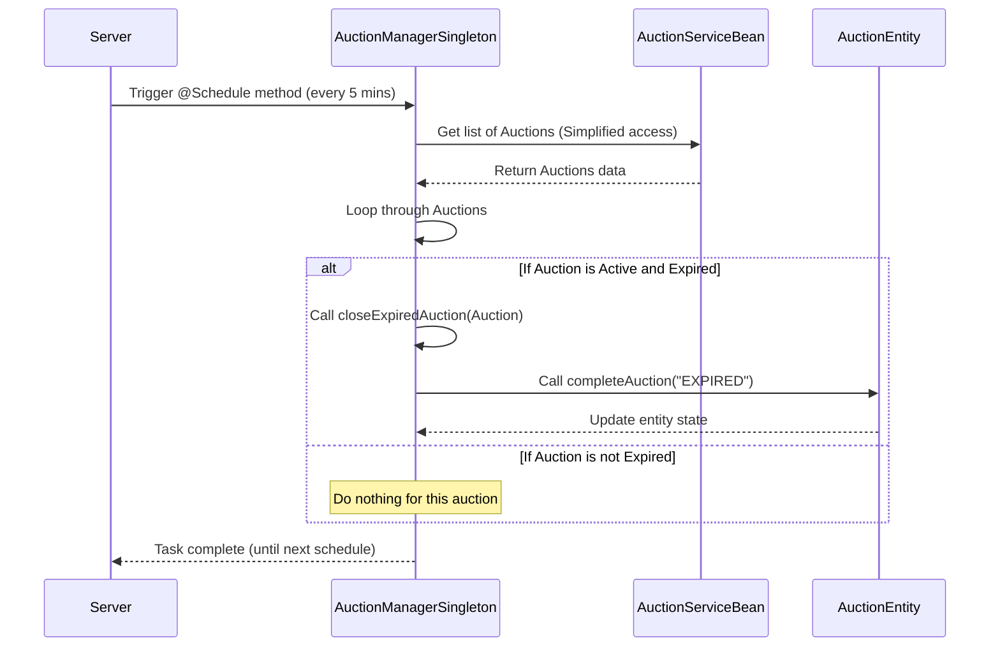

# Chapter 5: AuctionManagerSingleton

Welcome back to the AuctionSystem tutorial! In our journey so far, we've built the foundation: we know how to manage user sessions ([Chapter 1](01_user_session_management_.md)), represent our core data with Entities ([Chapter 2](02_entities__user__auction__bid__.md)), implement the business logic using Services ([Chapter 3](03_service_ejbs__auction__bid__user_.md)), and control access with Filters ([Chapter 4](04_filters__session__admin__encoding_.md)).

But what about tasks that don't happen because a user clicked a button or submitted a form? For instance, how does an auction *automatically* end when its time is up? Who keeps track of application-wide statistics like the total value of bids placed across all auctions?

These tasks require a central, always-available component that can perform actions independently or hold shared information for the entire application. This is where the **`AuctionManagerSingleton`** comes in.

## The Central Operator: What Problem Does It Solve?

Imagine the `AuctionSystem` is a bustling marketplace. You need someone or something that acts as the system's **central administrator** or **timekeeper**. This entity isn't tied to a single user's request; it's responsible for the overall health and operation of the marketplace itself.

Key tasks this central operator would handle:

1.  **Monitoring Time:** Regularly checking if any auctions have passed their scheduled end time.
2.  **Closing Auctions:** Automatically marking expired auctions as ended and determining the winner (if any).
3.  **Collecting Statistics:** Gathering system-wide data, like the total number of active auctions or the sum of all bids ever placed.
4.  **Cleanup:** Periodically removing old data that's no longer needed (like very old completed auctions).

These tasks don't fit neatly into a `UserService` (which focuses on a single user) or an `AuctionService` (which usually handles operations on a specific auction triggered by a user). They require a component that exists for the lifetime of the application and can run background jobs.

This is exactly what the `AuctionManagerSingleton` does.

## Key Concept: The Singleton EJB

In Java EE (the platform our AuctionSystem is built on), there's a special type of Enterprise JavaBean (EJB) designed for this exact purpose: the **Singleton EJB**.

Think of it like this:

*   `@Stateless` Service EJBs ([Chapter 3](03_service_ejbs__auction__bid__user_.md)) are like helpful staff members you can ask to perform a specific task (e.g., "place this bid"). The server might have many copies of them ready.
*   `@Singleton` EJBs are like the *manager's office* or the *main control room*. There is **only ever one instance** of a Singleton EJB created by the application server throughout the entire application's life.

This single instance is perfect for managing shared resources, coordinating application-wide activities, or holding global data.

The `AuctionManagerSingleton` is marked with the `@Singleton` annotation:

```java
// --- Snippet from src/main/java/com/auction/ejb/AuctionManagerSingleton.java ---
package com.auction.ejb;

import jakarta.ejb.Singleton;
// ... other imports ...

@Singleton // Tells the server to create only ONE instance
@Startup   // Tells the server to create this instance when the application starts
public class AuctionManagerSingleton {

    // ... implementation ...
}
```
*   `@Singleton`: This annotation tells the Java EE server "Make sure there's only one instance of this class available for the entire application."
*   `@Startup`: This annotation tells the server "Create this single instance as soon as the application starts, not waiting for the first time someone needs it." This is important because we want it ready to run scheduled tasks from the beginning.

Combined, these annotations ensure that our `AuctionManagerSingleton` is the unique, first responder for application-wide management tasks.

## Core Responsibilities

The `AuctionManagerSingleton` has two primary roles in our system:

1.  **Running Scheduled Background Tasks:** Using Java EE's built-in scheduling capabilities.
2.  **Providing System-Wide Statistics:** Holding and calculating metrics relevant to the entire auction platform.

Let's look at how it performs these roles.

### Running Scheduled Background Tasks: Checking Expired Auctions

The most critical background task is automatically closing auctions when they reach their end time. This is handled by a method specifically designed to be called on a schedule.

Java EE provides the `@Schedule` annotation for this:

```java
// --- Snippet from src/main/java/com/auction/ejb/AuctionManagerSingleton.java ---
// ... imports ...

@Singleton
@Startup
// ... other annotations ...
public class AuctionManagerSingleton {

    private static final Logger logger = Logger.getLogger(AuctionManagerSingleton.class.getName());

    // ... fields and lifecycle methods (@PostConstruct, @PreDestroy) ...

    // This method will be automatically called by the server
    @Schedule(hour = "*", minute = "*/5", persistent = false) // Configuration for the schedule
    public void checkExpiredAuctions() {
        logger.info("Checking for expired auctions...");

        // Simplified access to auction data for this example (normally via EJB injection/DB)
        var auctions = AuctionServiceBean.getAuctions();
        LocalDateTime now = LocalDateTime.now();

        // Stream through auctions, find active and expired ones, then close them
        long expiredCount = auctions.values().stream()
                .filter(auction -> auction.isActive() && auction.getEndTime().isBefore(now))
                .peek(this::closeExpiredAuction) // Call the method to close each expired auction
                .count(); // Count how many we closed

        if (expiredCount > 0) {
            logger.info("Processed " + expiredCount + " expired auctions");
        }
    }

    // Method to perform the actual closing logic for one auction
    @Lock(LockType.WRITE) // Ensure only one thread closes an auction at a time
    public void closeExpiredAuction(Auction auction) {
        logger.info("Closing expired auction: " + auction.getAuctionId());

        // Use the entity's method to update its state (see Chapter 2)
        auction.completeAuction("EXPIRED");

        // Log results (details omitted for brevity)
        // ... logging logic ...
    }

    // ... other methods ...
}
```
*   `@Schedule(hour = "*", minute = "*/5", persistent = false)`: This is the magic annotation. It tells the server to run the `checkExpiredAuctions` method automatically.
    *   `hour = "*"`: Run every hour.
    *   `minute = "*/5"`: Run every 5 minutes.
    *   `persistent = false`: The schedule is defined in the code and doesn't need to be stored in a database.
    *   So, this method runs every 5 minutes, 24/7, as long as the application is running.
*   Inside `checkExpiredAuctions`:
    *   It gets access to all the auctions managed by the `AuctionServiceBean`. *(Note: In a real-world app, you'd typically inject the `AuctionServiceRemote` EJB here using `@EJB` and ask the service for the list of auctions or query a database. Accessing static data (`AuctionServiceBean.getAuctions()`) is a simplification used in this specific example project).*
    *   It iterates through the list of auctions.
    *   It checks if an auction is still `isActive()` and if its `endTime` is `before(LocalDateTime.now())`.
    *   For every auction that meets these criteria, it calls the `closeExpiredAuction` method.
*   `closeExpiredAuction(Auction auction)`:
    *   `@Lock(LockType.WRITE)`: This is important for Singletons. It tells the server that this method *modifies* the singleton's data (or data it manages, like the Auction entity's state). The server will ensure that only one thread is executing a `WRITE` method at a time, preventing conflicts if the scheduler tries to close multiple auctions simultaneously or if another part of the application is also trying to modify auction data.
    *   It calls `auction.completeAuction("EXPIRED")`. This is a method on the `Auction` entity itself ([Chapter 2](02_entities__user__auction__bid__.md)) that updates its internal status (`isActive = false`, sets winner based on current bid, etc.). The singleton orchestrates *when* to call this method based on the schedule.

This scheduled task ensures that auctions transition from "Active" to "Expired" status automatically without requiring any user interaction.

Here's a simplified look at that scheduled process:



### Providing System-Wide Statistics

The `AuctionManagerSingleton` is also a good place to calculate and hold application-wide statistics because it's a single, accessible point. Other parts of the application can ask the singleton for these numbers.

```java
// --- Snippet from src/main/java/com/auction/ejb/AuctionManagerSingleton.java ---
// ... imports and existing methods ...

@Lock(LockType.READ) // These methods only read data, can run concurrently
public int getSystemStatus() {
    // Get count of active auctions
    var auctions = AuctionServiceBean.getAuctions();
    return (int) auctions.values().stream()
            .filter(auction -> auction.isActive())
            .count();
}

@Lock(LockType.READ) // These methods only read data, can run concurrently
public double getTotalBidVolume() {
    // Sum up all bid amounts across all auctions
    var auctions = AuctionServiceBean.getAuctions();
    return auctions.values().stream()
            .flatMap(auction -> auction.getBids().values().stream()) // Get all bids from all auctions
            .mapToDouble(bid -> bid.getBidAmount()) // Get the amount of each bid
            .sum(); // Sum the amounts
}

// NEW METHODS for enhanced statistics (as seen in the code file)
@Lock(LockType.READ)
public int getCompletedAuctionsCount() {
    // Get count of completed auctions
    var auctions = AuctionServiceBean.getAuctions();
    return (int) auctions.values().stream()
            .filter(auction -> !auction.isActive())
            .count();
}

@Lock(LockType.READ)
public double getCompletedAuctionsValue() {
    // Sum up the winning bid amount for completed auctions
    var auctions = AuctionServiceBean.getAuctions();
    return auctions.values().stream()
            .filter(auction -> !auction.isActive())
            .mapToDouble(Auction::getWinningBid) // Get the winning bid of completed auctions
            .sum(); // Sum the winning bids
}

// ... other methods ...
```
*   `@Lock(LockType.READ)`: This tells the server that these methods only *read* data. Multiple parts of the application can call these methods at the same time without causing issues, as they aren't modifying anything.
*   These methods again access the collection of auctions (using the same simplified access).
*   They use Java Streams to efficiently calculate the desired statistics by filtering and aggregating data from the `Auction` and `Bid` entities.
*   `getSystemStatus()`: Counts auctions where `isActive()` is true.
*   `getTotalBidVolume()`: Goes through all auctions, collects *all* their bids ([Chapter 2](02_entities__user__auction__bid__.md)), and sums up the `bidAmount` for every single bid ever placed.
*   `getCompletedAuctionsCount()`: Counts auctions that are *not* active.
*   `getCompletedAuctionsValue()`: Sums up the `winningBid` for all completed auctions.

These methods provide valuable insights into the system's activity.

## Using the AuctionManagerSingleton

Other parts of the application that need access to the singleton's capabilities can inject it using `@EJB`, just like they do with other EJBs.

A common place to use its statistics methods might be an administrative dashboard or a system status page.

```java
// Example: Inside a Servlet or other EJB that needs stats (conceptual)

// Inject the singleton EJB
@EJB
private AuctionManagerSingleton auctionManager;

// ... inside a method that generates admin page output ...

public void generateSystemStatsReport() {
    int activeAuctions = auctionManager.getSystemStatus();
    double totalVolume = auctionManager.getTotalBidVolume();
    int completedCount = auctionManager.getCompletedAuctionsCount();
    double completedValue = auctionManager.getCompletedAuctionsValue();

    System.out.println("--- Auction System Statistics ---");
    System.out.println("Active Auctions: " + activeAuctions);
    System.out.println("Total Bid Volume Ever: $" + totalVolume);
    System.out.println("Completed Auctions: " + completedCount);
    System.out.println("Value of Completed Auctions: $" + completedValue);
    System.out.println("---------------------------------");

    // ... pass these stats to a web page template to display ...
}
```
This code simply injects the `auctionManager` and calls its public methods (`getSystemStatus`, `getTotalBidVolume`, etc.) to retrieve the desired statistics. It doesn't need to know *how* the singleton calculates them.

## Under the Hood: Lifecycle and Concurrency

Beyond the `@Singleton`, `@Startup`, and `@Schedule` annotations, the `AuctionManagerSingleton` uses a few other Java EE features:

*   `@PostConstruct`:
    ```java
    @PostConstruct
    public void initialize() {
        logger.info("Initializing Auction Manager Singleton");
        // Create a background thread pool for *additional* scheduled tasks (optional, @Schedule is often enough)
        scheduler = Executors.newScheduledThreadPool(2);
        // Schedule other non-@Schedule tasks like cleanup
        scheduleAuctionCleanup();
        scheduleAuctionStatusUpdates();
        logger.info("Auction Manager Singleton initialized successfully");
    }
    ```
    This method is automatically called by the server *exactly once* after the singleton instance is created (`@Startup`) and dependency injection (`@EJB`) is finished. It's used here to perform any one-time setup, like creating the `ScheduledExecutorService` for tasks *not* handled by `@Schedule` annotations (like cleanup tasks added in the code).
*   `@PreDestroy`:
    ```java
    @PreDestroy
    public void cleanup() {
        logger.info("Shutting down Auction Manager Singleton");
        // Gracefully shut down the background scheduler created in @PostConstruct
        if (scheduler != null && !scheduler.isShutdown()) {
            scheduler.shutdown();
            // Wait a bit for tasks to finish
            try {
                if (!scheduler.awaitTermination(5, TimeUnit.SECONDS)) {
                    scheduler.shutdownNow(); // Force shutdown if tasks don't finish
                }
            } catch (InterruptedException e) {
                scheduler.shutdownNow();
                Thread.currentThread().interrupt();
            }
        }
        logger.info("Auction Manager Singleton shutdown complete");
    }
    ```
    This method is automatically called by the server *exactly once* just before the application is shut down and the singleton instance is destroyed. It's used to perform any necessary cleanup, like shutting down the background scheduler to prevent threads from running after the application stops.
*   `@ConcurrencyManagement(ConcurrencyManagementType.CONTAINER)`: This annotation, combined with `@Lock(LockType.READ)` and `@Lock(LockType.WRITE)`, tells the Java EE server to manage concurrent access to the singleton's methods. The server uses locks to ensure that:
    *   Multiple threads can call `@Lock(LockType.READ)` methods simultaneously.
    *   Only *one* thread can call an `@Lock(LockType.WRITE)` method at a time.
    *   No thread can call a `@Lock(LockType.READ)` method while a `@Lock(LockType.WRITE)` method is running, and vice-versa.
    This prevents data corruption if multiple requests or scheduled tasks try to read and write the same shared data at the same time.

These lifecycle and concurrency features are built into Java EE Singletons, making them robust for managing application-wide state and tasks.

## Summary

In this chapter, we explored the **`AuctionManagerSingleton`**, a special Singleton EJB:

*   It exists as a **single instance** for the entire application's lifetime, acting as a central manager.
*   It uses the `@Singleton` and `@Startup` annotations to achieve this.
*   Its main roles are running **scheduled background tasks** (like checking for expired auctions using `@Schedule`) and providing **system-wide statistics**.
*   The `@Schedule` annotation automates the execution of methods at defined intervals.
*   The singleton collaborates with other components (like accessing auction data, although simplified in this example) and modifies entity states (like calling `completeAuction` on an `Auction` entity).
*   It uses `@Lock(LockType.READ)` and `@Lock(LockType.WRITE)` along with `@ConcurrencyManagement` to safely handle multiple parts of the system accessing its data concurrently.
*   `@PostConstruct` and `@PreDestroy` handle setup and cleanup when the application starts and stops.

The `AuctionManagerSingleton` is essential for automating processes and providing a central point for application-wide data that isn't tied to any single user request.

Now that we've covered the core back-end components (entities, services, filters, and the singleton manager), we can move on to the parts of the application that users actually interact with directly: the Servlets that generate web pages.

[Next Chapter: Servlets (Auction, SessionAdmin)](06_servlets__auction__sessionadmin_.md)

---
