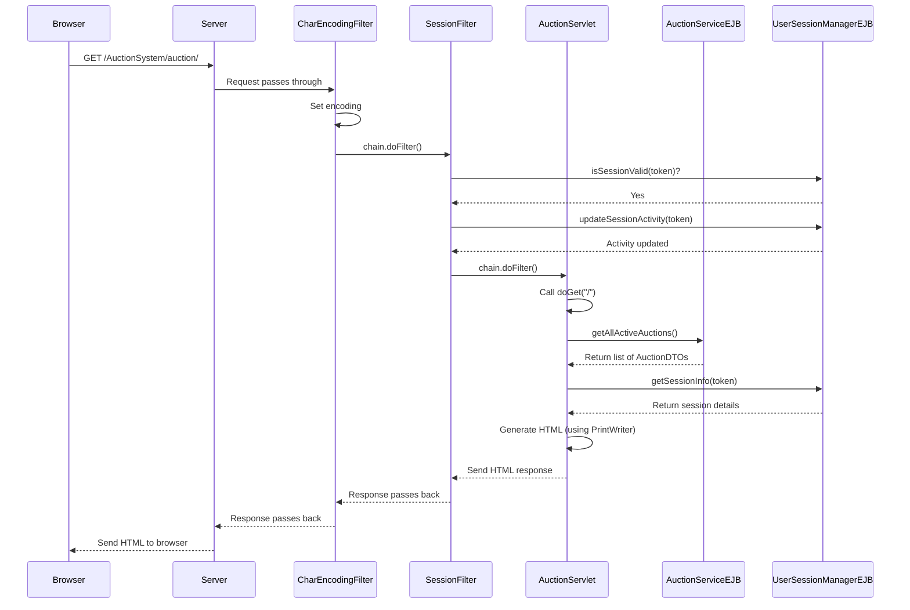

# Chapter 6: Servlets (Auction, SessionAdmin)

Welcome back to the AuctionSystem tutorial! In our previous chapters, we've established the back-end engine of our application:
*   [Chapter 1: User Session Management](01_user_session_management_.md) taught us how to track who is logged in.
*   [Chapter 2: Entities](02_entities__user__auction__bid__.md) defined the core data structures (users, auctions, bids).
*   [Chapter 3: Service EJBs](03_service_ejbs__auction__bid__user_.md) explained the "workforce" that performs business logic on these entities.
*   [Chapter 4: Filters](04_filters__session__admin__encoding_.md) showed us how to intercept requests for security and encoding.
*   [Chapter 5: AuctionManagerSingleton](05_auctionmanagersingleton_.md) introduced the central manager for background tasks and system-wide stats.

These components handle the "under the hood" work, but how do users actually *see* the auctions, log in, or place bids using their web browsers? How do button clicks and form submissions trigger the logic in our Service EJBs?

This is the job of **Servlets**.

## What are Servlets? The Web Interface

Think of a web application like a restaurant.
*   The kitchen staff and managers are like your **Service EJBs** and the **AuctionManagerSingleton** – they do the actual work (cooking, managing inventory).
*   The ingredients and recipes are like your **Entities** – the data and its structure.
*   The security guards at the door are like your **Filters** – checking who is allowed in and where they can go.

But someone needs to take the customer's order, communicate it to the kitchen, and bring the finished dish back to the table. In a web application, **Servlets** play this role.

A **Servlet** is essentially a Java class that runs on a web server and is designed to handle incoming web requests (specifically, HTTP requests from browsers) and generate dynamic responses (usually HTML pages).

They act as the **front-end controllers**:
1.  A user's browser sends an **HTTP request** (e.g., clicking a link to view an auction, submitting a login form).
2.  The web server receives the request and, based on the URL, sends it to the appropriate **Servlet** (potentially after passing through **Filters** first).
3.  The Servlet receives the request, extracts necessary information (like form data or URL parameters).
4.  The Servlet then calls the relevant **Service EJBs** ([Chapter 3](03_service_ejbs__auction__bid__user_.md)) to perform the actual business logic (e.g., authenticate the user, get auction details, place a bid).
5.  The Service EJB processes the request and returns data (e.g., the user's profile, a list of auctions, confirmation of a successful bid).
6.  The Servlet takes this data and dynamically generates an **HTTP response**, typically an HTML page, which might include the data received from the EJB.
7.  The Servlet sends the response back to the web server, which sends it back to the user's browser to be displayed.

## Key Concepts

*   **HTTP Request/Response:** The fundamental communication method on the web. A request contains details about what the browser wants (URL, form data, headers), and a response contains the server's reply (HTML, status codes, headers).
*   **`HttpServlet`:** The standard Java class you extend to create a Servlet that handles HTTP requests.
*   **`doGet` / `doPost`:** Methods in `HttpServlet` that you override to handle GET requests (typically for viewing pages, retrieving data) and POST requests (typically for submitting forms, performing actions like logging in or placing a bid).
*   **`HttpServletRequest`:** An object provided to `doGet`/`doPost` that contains all the details of the incoming request. You use it to get parameters (`getParameter`), headers (`getHeader`), session (`getSession`), etc.
*   **`HttpServletResponse`:** An object provided to `doGet`/`doPost` that you use to build the response. You set content type (`setContentType`), status codes (`setStatus`), redirect (`sendRedirect`), and get a `PrintWriter` to write the response body (`getWriter`).
*   **URL Mapping (`@WebServlet`):** An annotation placed on your Servlet class that tells the web server which URL patterns this Servlet should handle. For example, `@WebServlet("/auction/*")` means the Servlet handles any URL starting with `/auction/`.

## How Our Servlets Fit In

In our AuctionSystem, we have two main Servlets that handle the user-facing parts of the web application:

1.  **`AuctionServlet`**: This is the primary Servlet. It's responsible for handling most of the user interactions:
    *   Displaying the main list of active and completed auctions.
    *   Showing the login and registration forms.
    *   Handling login and registration submissions.
    *   Displaying individual auction details pages.
    *   Handling bid submissions.
    *   Showing user profiles and allowing password changes.
    *   Displaying system status and user lists (for authenticated users).
2.  **`SessionAdminServlet`**: This Servlet is specifically for administrator tasks related to session management.
    *   Displaying a dashboard of all active user sessions.
    *   Providing actions to force-logout individual sessions or all sessions for a specific user.
    *   Triggering manual cleanup of expired sessions.

Notice that the `SessionAdminServlet` handles URLs under `/auction/admin/sessions/*`. As we learned in [Chapter 4: Filters](04_filters__session__admin__encoding_.md), the `AdminFilter` and `SessionFilter` are configured to intercept requests to these URLs *before* they reach the `SessionAdminServlet`, ensuring that only logged-in administrators can access it.

## Using the Servlets (URLs)

Users interact with these Servlets simply by typing URLs into their browser or clicking links on the web pages generated by the Servlets themselves.

The `@WebServlet` annotation defines the entry points:

```java
// --- Snippet from src/main/java/com/auction/servlet/AuctionServlet.java ---
@WebServlet(name = "AuctionServlet", urlPatterns = {"/auction/*"})
public class AuctionServlet extends HttpServlet {
    // ... methods ...
}
```
This means `AuctionServlet` handles URLs like:
*   `/AuctionSystem/auction/` (the base path)
*   `/AuctionSystem/auction/view/123` (view auction details)
*   `/AuctionSystem/auction/bid` (handle bid submission POST request)
*   `/AuctionSystem/auction/login` (handle login POST request)
*   `/AuctionSystem/auction/profile` (view profile GET request)
*   `/AuctionSystem/auction/create` (handle auction creation POST request)
*   etc.

The Servlet code inspects the `request.getPathInfo()` to determine which specific page or action is being requested under the `/auction/` pattern.

```java
// --- Snippet from src/main/java/com/auction/servlet/SessionAdminServlet.java ---
@WebServlet(name = "SessionAdminServlet", urlPatterns = {"/auction/admin/sessions/*"})
public class SessionAdminServlet extends HttpServlet {
    // ... methods ...
}
```
This means `SessionAdminServlet` handles URLs like:
*   `/AuctionSystem/auction/admin/sessions/` (the base path for the admin dashboard)
*   `/AuctionSystem/auction/admin/sessions/cleanup` (trigger cleanup GET request)
*   This URL is protected by both `SessionFilter` and `AdminFilter` before this Servlet even sees the request.

## Under the Hood: How They Work

Let's look at the basic structure and key interactions within these Servlets.

### Getting Access to Business Logic (EJBs)

Servlets don't contain the business logic themselves; they delegate it to the Service EJBs. They get references to these EJBs using the `@EJB` annotation, which the Java EE server automatically handles (dependency injection).

```java
// --- Snippet from src/main/java/com/auction/servlet/AuctionServlet.java ---
// ... imports ...
import jakarta.ejb.*; // Important import for @EJB

@WebServlet(name = "AuctionServlet", urlPatterns = {"/auction/*"})
public class AuctionServlet extends HttpServlet {

    // Injecting the EJBs needed by this Servlet
    @EJB
    private AuctionServiceRemote auctionService; // For managing auctions

    @EJB
    private BidServiceRemote bidService;       // For managing bids

    @EJB
    private UserServiceRemote userService;       // For managing users

    @EJB
    private AuctionManagerSingleton auctionManager; // For system stats/tasks

    @EJB
    private UserSessionManagerRemote sessionManager; // For checking/updating session info

    // ... rest of the class ...
}
```
This shows how `AuctionServlet` gets references to all the core Service EJBs and the Singleton manager, ready to call their methods. `SessionAdminServlet` similarly injects `UserSessionManagerRemote` and `UserServiceRemote`.

### Handling GET Requests (`doGet`)

The `doGet` method is called when a user navigates to a URL handled by the Servlet, typically requesting to view something. The Servlet inspects the requested `pathInfo` to decide what to display.

```java
// --- Snippet from src/main/java/com/auction/servlet/AuctionServlet.java ---
    @Override
    protected void doGet(HttpServletRequest request, HttpServletResponse response)
            throws ServletException, IOException {

        response.setContentType("text/html;charset=UTF-8"); // Tell the browser the response is HTML/UTF-8
        PrintWriter out = response.getWriter(); // Get a writer to print HTML

        String pathInfo = request.getPathInfo(); // Get the part of the URL after /auction/

        try {
            if (pathInfo == null || pathInfo.equals("/")) {
                // Handles /AuctionSystem/auction/
                showMainAuctionPage(request, out);
            } else if (pathInfo.startsWith("/view/")) {
                // Handles /AuctionSystem/auction/view/123
                String auctionIdStr = pathInfo.substring("/view/".length());
                Long auctionId = Long.parseLong(auctionIdStr);
                showAuctionDetails(request, out, auctionId); // Call helper method
            }
            // ... other URL paths like /users, /status, /profile, etc. ...
            else {
                showError(out, "Page not found", "The requested page does not exist.");
            }
        } catch (Exception e) {
            // ... error handling ...
        }
    }
    // ... helper methods like showMainAuctionPage, showAuctionDetails, etc. ...
```
This snippet shows the `doGet` method getting the `pathInfo` and using `if/else if` statements to route the request to different helper methods (`showMainAuctionPage`, `showAuctionDetails`, etc.). These helper methods then contain the logic to fetch data and generate the specific HTML page.

**Example: Showing Auction Details (`showAuctionDetails`)**

When a user requests `/auction/view/123`, `doGet` routes to `showAuctionDetails(request, out, 123L)`.

```java
// --- Snippet from src/main/java/com/auction/servlet/AuctionServlet.java ---
    private void showAuctionDetails(HttpServletRequest request, PrintWriter out, Long auctionId) {
        // ... get current user and login status ...

        // Call the AuctionService EJB to get the auction data
        AuctionDTO auction = auctionService.getAuction(auctionId);
        if (auction == null) {
            // Show error if auction not found
            showError(out, "Auction Not Found", "The requested auction does not exist.");
            return;
        }

        // Call the BidService EJB to get bids for this auction
        List<Bid> bids = bidService.getBidsForAuction(auctionId);

        // --- Start generating HTML response ---
        out.println("<!DOCTYPE html>");
        out.println("<html lang='en'>");
        // ... print head section (title, CSS) ...
        out.println("<body>");
        // ... print navigation, messages ...

        out.println("<h1>🏺 " + escapeHtml(auction.getTitle()) + "</h1>"); // Print the auction title
        // ... print other auction details by calling auction.get...() ...

        // --- Bidding Section (Conditional based on login/status) ---
        boolean isExpired = auction.getEndTime().isBefore(LocalDateTime.now());
        if (auction.isActive() && !isExpired && isLoggedIn) {
            // Show the form to place a bid if logged in and auction is active
            showBiddingSection(out, auction); // Helper method to print the form HTML
        }
        // ... else show completion info or login message ...

        // --- Bid History Section ---
        showBidHistorySection(out, bids, auction.isActive() && !isExpired); // Helper to print bid table

        // ... print footer, WebSocket script ...
        out.println("</body></html>");
    }
    // ... other helper methods ...
```
This shows `showAuctionDetails` calling `auctionService.getAuction()` and `bidService.getBidsForAuction()` to retrieve data using the EJBs. It then uses `out.println()` multiple times to directly print the HTML structure of the auction details page, embedding data from the `AuctionDTO` and `Bid` objects it received.

### Handling POST Requests (`doPost`)

The `doPost` method is typically used for handling form submissions. It gets data from form parameters (`request.getParameter`), calls the relevant EJB logic, and usually redirects the user to a new page (using `response.sendRedirect`) instead of generating an HTML response directly. Redirection prevents users from accidentally resubmitting the same form if they refresh the page.

```java
// --- Snippet from src/main/java/com/auction/servlet/AuctionServlet.java ---
    @Override
    protected void doPost(HttpServletRequest request, HttpServletResponse response)
            throws ServletException, IOException {

        response.setContentType("text/html;charset=UTF-8");
        // PrintWriter out = response.getWriter(); // Often not needed for POST if redirecting

        String pathInfo = request.getPathInfo(); // Get the part of the URL after /auction/

        try {
            if (pathInfo != null && pathInfo.equals("/bid")) {
                // Handles POST requests to /AuctionSystem/auction/bid
                handleBidSubmission(request, response); // Call helper method
            } else if (pathInfo != null && pathInfo.equals("/login")) {
                 // Handles POST requests to /AuctionSystem/auction/login
                handleUserLogin(request, response); // Call helper method
            }
            // ... other POST paths like /register, /create, /change-password ...
            else {
                // ... handle invalid POST ...
                 response.sendRedirect("/AuctionSystem/auction/?error=invalid_action");
            }
        } catch (Exception e) {
            // ... error handling ...
             response.sendRedirect("/AuctionSystem/auction/?error=system_error");
        }
    }
    // ... helper methods like handleBidSubmission, handleUserLogin, etc. ...
```
Similar to `doGet`, `doPost` inspects `pathInfo` to figure out the action. Let's look at a simplified `handleBidSubmission`.

**Example: Handling Bid Submission (`handleBidSubmission`)**

When a user submits the bid form on the auction details page, the browser sends a POST request to `/auction/bid`. `doPost` routes it here.

```java
// --- Snippet from src/main/java/com/auction/servlet/AuctionServlet.java ---
    private void handleBidSubmission(HttpServletRequest request, HttpServletResponse response)
            throws ServletException, IOException {

        String currentUser = getCurrentUser(request); // Get username from session
        if (currentUser == null) {
            // Redirect if not logged in (though SessionFilter should handle this)
            response.sendRedirect("/AuctionSystem/auction/?error=not_logged_in");
            return;
        }

        try {
            // Get data from the form parameters
            String auctionIdStr = request.getParameter("auctionId");
            String bidAmountStr = request.getParameter("bidAmount");

            Long auctionId = Long.parseLong(auctionIdStr);
            double bidAmount = Double.parseDouble(bidAmountStr);

            // Update session activity (SessionFilter does this too, but belt-and-suspenders)
            updateSessionActivity(request);

            // Call the BidService EJB to place the bid!
            boolean success = bidService.placeBid(auctionId, currentUser, bidAmount);

            // Redirect based on success or failure
            if (success) {
                logger.info("Bid placed successfully: ...");
                // Redirect back to the auction page with a success message
                response.sendRedirect("/AuctionSystem/auction/view/" + auctionId + "?success=bid_placed");
            } else {
                logger.warning("Bid placement failed: ...");
                // Redirect back with an error message
                response.sendRedirect("/AuctionSystem/auction/view/" + auctionId + "?error=invalid_bid");
            }

        } catch (NumberFormatException e) {
            // Handle invalid number input
            logger.warning("Invalid number format in bid placement: " + e.getMessage());
            response.sendRedirect("/AuctionSystem/auction/?error=invalid_numbers");
        } catch (Exception e) {
            // Handle other potential errors
            logger.severe("Error placing bid: " + e.getMessage());
            response.sendRedirect("/AuctionSystem/auction/?error=system_error");
        }
    }
    // ... other helper methods ...
```
This method demonstrates the typical POST handling pattern:
1.  Get input from `request.getParameter()`.
2.  Perform basic validation (missing fields, number format).
3.  Call the relevant EJB method (`bidService.placeBid()`).
4.  Check the result from the EJB.
5.  Redirect the user to another page, including messages (success/error) as URL parameters.

### Direct HTML Generation

As you can see in the code snippets, both `AuctionServlet` and `SessionAdminServlet` generate the entire HTML response by directly printing strings using `PrintWriter out = response.getWriter();` and `out.println(...)`.

```java
// Example: Part of showMainAuctionPage or showAuctionDetails
out.println("<!DOCTYPE html>");
out.println("<html lang='en'>");
out.println("<head>");
out.println("<meta charset='UTF-8'>");
out.println("<title>Auction Details - " + escapeHtml(auction.getTitle()) + "</title>");
// ... link CSS, etc. ...
out.println("</head>");
out.println("<body>");
// ... generate body content, tables, forms ...
out.println("</body></html>");
```
While effective for this project, directly printing HTML inside Servlets can become hard to manage for complex pages. Larger applications often use JavaServer Pages (JSPs) or templating engines (like Thymeleaf, Freemarker) where the HTML structure is in separate files, and the Servlet just passes data to the template for rendering. This project uses direct printing for simplicity.

### `SessionAdminServlet` in Action

The `SessionAdminServlet` works very similarly but is focused on session data:

```java
// --- Snippet from src/main/java/com/auction/servlet/SessionAdminServlet.java ---
@WebServlet(name = "SessionAdminServlet", urlPatterns = {"/auction/admin/sessions/*"})
public class SessionAdminServlet extends HttpServlet {

    @EJB // Injected Session Manager
    private UserSessionManagerRemote sessionManager;

    @EJB // Injected User Service (to check admin status for display)
    private UserServiceRemote userService;

    // ... doGet method routing ...

    private void showSessionDashboard(HttpServletRequest request, PrintWriter out) {
        // Call the SessionManager EJB to get active sessions
        List<ActiveSessionInfo> sessions = sessionManager.getAllActiveSessions();
        // Call the SessionManager EJB to get session counts per user
        Map<String, Integer> userCounts = sessionManager.getUserSessionCounts();

        // --- Start generating HTML dashboard ---
        out.println("<!DOCTYPE html>");
        // ... print head (title, CSS) ...
        out.println("<body>");
        // ... print admin navigation, messages ...

        // --- Print Session Statistics Section ---
        showSessionStatistics(out); // Helper method using sessionManager.getActiveSessionCount()

        // --- Print User Session Counts Table ---
        showUserSessionCounts(out, userCounts); // Helper using userCounts map and userService.isUserAdmin()

        // --- Print Active Sessions Table ---
        showActiveSessionsTable(out, sessions); // Helper looping through sessions list

        // ... print footer ...
        out.println("</body></html>");
    }

    // ... doPost method routing logout actions ...

    // Example handle logout POST
    @Override
    protected void doPost(HttpServletRequest request, HttpServletResponse response)
            throws ServletException, IOException {

        String action = request.getParameter("action");
        String username = request.getParameter("username"); // For logoutUser
        String sessionToken = request.getParameter("sessionToken"); // For logoutSession

        try {
            if ("logoutUser".equals(action) && username != null) {
                // Call SessionManager EJB to log out user
                sessionManager.logoutUser(username);
                response.sendRedirect("/AuctionSystem/auction/admin/sessions/?message=user_logged_out");
            } else if ("logoutSession".equals(action) && sessionToken != null) {
                 // Call SessionManager EJB to log out specific session
                sessionManager.logout(sessionToken);
                response.sendRedirect("/AuctionSystem/auction/admin/sessions/?message=session_logged_out");
            }
             // ... handle invalid action ...
        } catch (Exception e) {
            // ... error handling ...
        }
    }
}
```
This shows the `SessionAdminServlet` injecting the necessary EJBs, fetching data (`sessionManager.getAllActiveSessions`, `sessionManager.getUserSessionCounts`), and printing HTML tables and statistics. The `doPost` method receives logout requests (sent via forms on the dashboard page) and calls the corresponding `sessionManager` methods to terminate sessions.

## Servlet Request Processing Flow (Simplified)

Let's visualize a simple flow: A logged-in user views the main auction page.


This diagram illustrates how Filters intercept first, followed by the Servlet. The Servlet then calls EJBs to get data before generating the final HTML response that travels back through the filters (if they have post-processing logic) and to the user's browser.

## Summary

In this chapter, we've seen how **Servlets** act as the crucial front-end component of our web application:

*   They are Java classes that handle incoming **HTTP requests** from user browsers.
*   They route requests (`doGet`, `doPost`) based on the requested **URL patterns** (`@WebServlet`).
*   They delegate the complex business logic to the **Service EJBs** ([Chapter 3](03_service_ejbs__auction__bid__user_.md)) and interact with managers like the **UserSessionManager** ([Chapter 1](01_user_session_management_.md)) and **AuctionManagerSingleton** ([Chapter 5](05_auctionmanagersingleton_.md)) using `@EJB` injection.
*   They are responsible for dynamically generating the **HTML responses** that are sent back to the browser (in this project, primarily by directly printing HTML).
*   The `AuctionServlet` handles most user interactions and displays.
*   The `SessionAdminServlet` handles administrative tasks related to sessions, protected by **Filters** ([Chapter 4](04_filters__session__admin__encoding_.md)).

Servlets connect the user interface (web pages) to the back-end business logic (EJBs), orchestrating the flow of data and control for each web request.

We've now covered the main components that handle synchronous user requests and background management. But how does the system handle asynchronous events, like notifying users instantly when a new bid is placed? That's where messaging comes in.

[Next Chapter: JMS Messaging (Bid Notifications)](07_jms_messaging__bid_notifications_.md)

---
