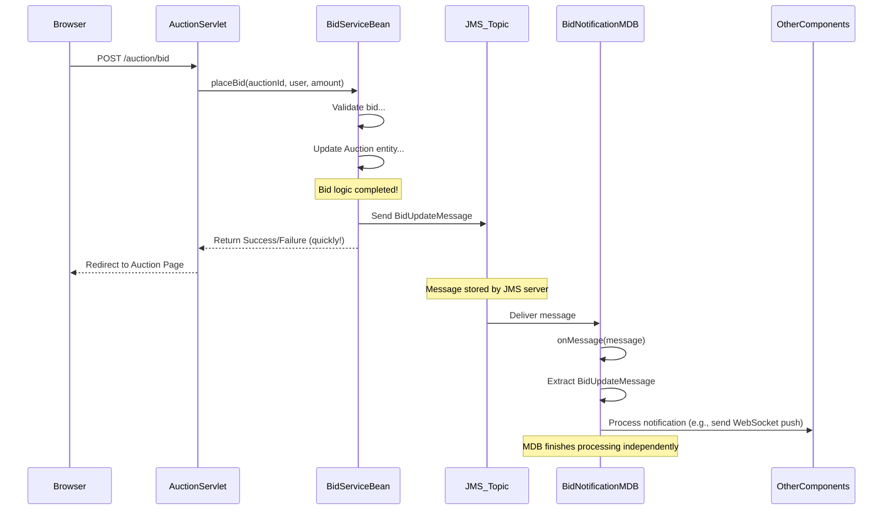

# Chapter 7: JMS Messaging (Bid Notifications)

Welcome back to the AuctionSystem tutorial! In the [previous chapter](06_servlets__auction__sessionadmin_.md), we explored **Servlets**, which are the components that handle incoming web requests and generate HTML pages. Servlets orchestrate the flow, calling our **Service EJBs** ([Chapter 3: Service EJBs (Auction, Bid, User)](03_service_ejbs__auction__bid__user_.md)) to perform business logic.

This works well for tasks where the user waits for a response (like loading an auction page or getting confirmation that their bid was placed). But what about actions that need to happen *independently* or notify *many* people without slowing down the person who triggered the action?

Consider the act of **placing a bid**. When a user places a bid:
1.  The system needs to record the bid.
2.  The system needs to update the auction's highest bid.
3.  **Critically:** Other users who are watching that auction need to be notified *instantly* that a new bid has been placed, so they can react.

If our `BidService` tried to directly update every user's browser or send emails right inside the `placeBid` method, the user placing the bid would have to wait for *all* those notifications to finish! This would be slow, inefficient, and the bid placement might even fail if a notification mechanism has a temporary problem.

We need a way for the `BidService` to say, "Hey, something important happened (a new bid!), someone else should handle notifying interested parties," and then immediately finish its main job of placing the bid.

This is where **JMS Messaging** comes in.

## What is JMS Messaging? The Reliable Messenger Service

**JMS (Java Message Service)** is a standard Java API that provides a robust way for different parts of an application (or even different applications) to communicate asynchronously using messages.

Think of it like a **reliable postal service** or a **public bulletin board** for important internal events.

Instead of component A directly calling methods on component B and waiting for a response, component A sends a **message** to a designated **destination**. The JMS server takes responsibility for holding onto that message and delivering it to any component B, C, or D that is interested in receiving messages from that destination.

Key benefits:
*   **Asynchronous:** The sender (producer) doesn't wait for the receiver (consumer) to process the message. It sends and forgets.
*   **Decoupling:** The sender doesn't need to know *who* the receivers are or *how* they will process the message. It just needs to know the destination. Receivers don't need to know who sent the message.
*   **Reliability:** The JMS server ensures messages are delivered, often with guarantees like "once and only once" processing, even if components go offline temporarily.
*   **Scalability:** You can add more consumers to handle a high volume of messages.

## Key Concepts in JMS

Here are the core ideas behind JMS that we use:

1.  **Message:** This is the data being exchanged. It's like the letter or package in the postal service analogy. It can be simple text, a data object, etc.
2.  **Producer:** The component that creates and sends messages. Our `BidServiceBean` is a producer.
3.  **Consumer:** The component that receives and processes messages. Our `BidNotificationMDB` is a consumer.
4.  **Destination:** Where messages are sent and received from. There are two main types:
    *   **Queue (Point-to-Point):** Messages are sent to a queue, and typically only *one* consumer receives and processes each message. Good for task distribution (e.g., a queue of "process order" messages handled by worker processes).
    *   **Topic (Publish/Subscribe):** Messages are sent to a topic, and *all* consumers who are subscribed to that topic receive a *copy* of the message. Good for notifications or broadcasting (e.g., a "stock price update" topic where all interested parties get the update). We use a **Topic** for bid notifications because we want *all* interested clients (via the MDB) to know about *every* new bid.
5.  **Message-Driven Bean (MDB):** A special type of EJB that acts as a JMS consumer. MDBs automatically listen to a specific queue or topic. When a message arrives, the application server automatically creates or reuses an MDB instance and calls its `onMessage()` method to process the message. This is the perfect component for our `BidNotificationMDB`.

## Use Case: Asynchronous Bid Notifications

Let's trace the "Place Bid" scenario focusing on how JMS makes the notification asynchronous.



1.  The user places a bid via the browser, hitting the `AuctionServlet` ([Chapter 6](06_servlets__auction__sessionadmin_.md)).
2.  The `AuctionServlet` calls `BidService.placeBid` ([Chapter 3](03_service_ejbs__auction__bid__user_.md)).
3.  The `BidServiceBean` performs the core logic (validation, updating the `Auction` entity).
4.  **Crucial Step:** Instead of directly handling notifications, the `BidServiceBean` creates a message containing the bid details and sends it to the `jms/topic/BidUpdates` Topic.
5.  The `BidServiceBean` *immediately* returns the result (success or failure) back to the `AuctionServlet`. The user's request is finished quickly.
6.  Meanwhile, the JMS server receives the message and holds it in the `jms/topic/BidUpdates` Topic.
7.  Our `BidNotificationMDB` is listening to this specific topic. When the server sees a new message on the topic, it delivers a copy to the MDB.
8.  The MDB's `onMessage()` method is triggered automatically.
9.  Inside `onMessage()`, the MDB extracts the bid details from the message and then performs the actual notification tasks (like sending a real-time update via WebSocket, which we'll cover in the next chapter, or simulating email notifications).
10. The MDB processes these notifications *asynchronously*, without affecting the user who placed the bid.

This pattern completely decouples the bid placement logic from the notification logic.

## Implementing the Producer (`BidServiceBean`)

Let's look at the parts of the `BidServiceBean` that send the message.

First, the service needs access to the JMS infrastructure provided by the application server. This is done using `@Resource` injection:

```java
// --- Snippet from src/main/java/com/auction/ejb/BidServiceBean.java ---
// ... imports ...
import jakarta.annotation.Resource; // Import for @Resource
import jakarta.jms.*; // Import JMS classes

@Stateless
@Remote(BidServiceRemote.class)
public class BidServiceBean implements BidServiceRemote {

    // ... other code ...

    // Inject the JMS ConnectionFactory provided by the server
    @Resource(mappedName = "jms/ConnectionFactory")
    private ConnectionFactory connectionFactory;

    // Inject the JMS Topic configured in the server
    @Resource(mappedName = "jms/topic/BidUpdates")
    private Topic bidUpdatesTopic;

    // ... rest of the class ...
}
```
*   `@Resource`: This annotation is used to inject external resources managed by the application server, like JDBC DataSources, Mail Sessions, and JMS objects.
*   `connectionFactory`: This is the standard way to get a connection to the JMS server. `jms/ConnectionFactory` is a common default JNDI name.
*   `bidUpdatesTopic`: This is a reference to the specific Topic we want to send messages to. `jms/topic/BidUpdates` is a JNDI name configured on the server (like GlassFish or WildFly) to represent this topic.

Next, the `placeBid` method calls a helper method to send the notification message *after* the bid has been successfully validated and recorded:

```java
// --- Snippet from src/main/java/com/auction/ejb/BidServiceBean.java ---
    @Override
    public boolean placeBid(Long auctionId, String username, double bidAmount) {
        // ... validation and auction update logic ...

        synchronized (auction) {
            // ... bid placement logic ...

            logger.info("Bid placed successfully: " + newBid.getBidId());

            // Send JMS notification (with error handling)
            try {
                sendBidUpdateNotification(auction, newBid); // Call the new method
            } catch (Exception e) {
                logger.warning("Failed to send JMS notification, but bid was placed: " + e.getMessage());
                // Don't fail the bid placement if JMS fails
            }

            return true;
        }
    }

    // Helper method to send the JMS message
    private void sendBidUpdateNotification(Auction auction, Bid newBid) throws JMSException {
        try {
            // Basic check if resources were injected
            if (connectionFactory == null || bidUpdatesTopic == null) {
                logger.warning("JMS resources not available, notification skipped");
                return;
            }

            // Create JMS connection, session, and producer
            try (Connection connection = connectionFactory.createConnection(); // Get a connection
                 Session session = connection.createSession(false, Session.AUTO_ACKNOWLEDGE)) { // Create a session

                MessageProducer producer = session.createProducer(bidUpdatesTopic); // Create a producer for our topic

                // Create the data transfer object (DTO) for the message
                BidUpdateMessage updateMessage = new BidUpdateMessage(
                        auction.getAuctionId(),
                        auction.getTitle(), // Include auction title
                        newBid.getBidAmount(),
                        newBid.getBidderUsername(),
                        newBid.getBidTime()
                );

                // Create an ObjectMessage containing our DTO
                ObjectMessage message = session.createObjectMessage(updateMessage);

                // Optional: Add properties to the message header
                message.setStringProperty("auctionId", auction.getAuctionId().toString());

                // Send the message!
                producer.send(message);
                logger.info("Bid update notification sent for auction: " + auction.getAuctionId());

            } // Connection and Session are closed automatically by try-with-resources
        } catch (JMSException e) {
            logger.warning("Failed to send bid update notification: " + e.getMessage());
            throw e; // Re-throw to be caught by placeBid's try/catch
        }
    }
// ... rest of the class ...
```
*   The `sendBidUpdateNotification` method is called *after* the database/in-memory state is updated.
*   It gets a `Connection` from the `ConnectionFactory`.
*   It creates a `Session` from the `Connection`. A session is needed to create messages and producers/consumers. `false, Session.AUTO_ACKNOWLEDGE` is a common pattern: `false` means the session is not transacted, and `AUTO_ACKNOWLEDGE` means the JMS server automatically confirms message receipt.
*   It creates a `MessageProducer` linked to our `bidUpdatesTopic`.
*   It creates a `BidUpdateMessage` object. This is a simple **Data Transfer Object (DTO)** ([`BidUpdateMessage.java`](#file-srcmainjavacomauctiondtobidupdatemessagejava)) that just holds the necessary data fields (`auctionId`, `bidAmount`, etc.) needed by the consumers.
*   It wraps the `BidUpdateMessage` DTO inside a JMS `ObjectMessage`. `ObjectMessage` is suitable for sending Java objects. *Note: The DTO must implement `Serializable`.*
*   `producer.send(message)`: This is the call that sends the message to the Topic. Once this call completes, the message is handed off to the JMS server, and the `sendBidUpdateNotification` method (and thus `placeBid`) can finish quickly.

## Implementing the Consumer (`BidNotificationMDB`)

Now, let's look at the component that *receives* these messages: the `BidNotificationMDB`.

This is a **Message-Driven Bean (MDB)**, declared using the `@MessageDriven` annotation.

```java
// --- Snippet from src/main/java/com/auction/ejb/BidNotificationMDB.java ---
package com.auction.ejb;

import com.auction.dto.BidUpdateMessage; // Import the DTO
import com.auction.websocket.AuctionWebSocketEndpoint; // Link to next chapter's component
import jakarta.ejb.ActivationConfigProperty; // For MDB configuration
import jakarta.ejb.MessageDriven; // Annotation for MDB
import jakarta.jms.JMSException;
import jakarta.jms.Message; // The generic message type
import jakarta.jms.MessageListener; // Interface MDB must implement
import jakarta.jms.ObjectMessage; // Specific message type we expect
import java.util.logging.Logger;

@MessageDriven(name = "BidNotificationMDB", activationConfig = {
        // Link this MDB to the specific JMS Topic
        @ActivationConfigProperty(propertyName = "destinationLookup",
                propertyValue = "jms/topic/BidUpdates"),
        @ActivationConfigProperty(propertyName = "destinationType",
                propertyValue = "jakarta.jms.Topic"),
        // How the server should handle acknowledgements
        @ActivationConfigProperty(propertyName = "acknowledgeMode",
                propertyValue = "Auto-acknowledge")
})
public class BidNotificationMDB implements MessageListener { // Must implement MessageListener

    private static final Logger logger = Logger.getLogger(BidNotificationMDB.class.getName());

    @Override // This method is called automatically by the server when a message arrives
    public void onMessage(Message message) {
        logger.info("=== BidNotificationMDB.onMessage() CALLED ===");
        try {
            logger.info("Received message of type: " + message.getClass().getName());

            // Check if the message is the type we expect (ObjectMessage)
            if (message instanceof ObjectMessage) {
                ObjectMessage objectMessage = (ObjectMessage) message;
                Object obj = objectMessage.getObject(); // Get the object inside

                // Check if the object inside is our BidUpdateMessage DTO
                if (obj instanceof BidUpdateMessage) {
                    BidUpdateMessage bidUpdate = (BidUpdateMessage) obj;
                    logger.info("Processing BidUpdateMessage: " + bidUpdate.toString());
                    handleBidUpdate(bidUpdate); // Call a helper method to process
                } else {
                    logger.warning("Received unexpected object type: " + obj.getClass().getName());
                }
            } else {
                logger.warning("Received non-ObjectMessage: " + message.getClass().getName());
            }

        } catch (JMSException e) {
            // Log JMS errors
            logger.severe("JMS Error processing message: " + e.getMessage());
            // Depending on acknowledgeMode, server might try redelivery
        } catch (Exception e) {
            // Log any other processing errors
            logger.severe("Unexpected error processing message: " + e.getMessage());
        }
        logger.info("=== BidNotificationMDB.onMessage() COMPLETED ===");
    }

    // Helper method to perform the actual notification logic
    private void handleBidUpdate(BidUpdateMessage bidUpdate) {
        logger.info("=== handleBidUpdate() START ===");
        logger.info("Processing bid update for auction: " + bidUpdate.getAuctionId());

        // 1. Send REAL WebSocket notifications (Details in Chapter 8)
        sendRealTimeNotification(bidUpdate);

        // 2. Simulate email notifications (Example of another task)
        simulateEmailNotification(bidUpdate);

        // 3. Log analytics (Example of another task)
        simulateAnalyticsLogging(bidUpdate);

        logger.info("=== handleBidUpdate() END ===");
    }

    // --- Methods called by handleBidUpdate (simulated or linking to other components) ---

    private void sendRealTimeNotification(BidUpdateMessage bidUpdate) {
         logger.info(String.format("REAL-TIME PUSH: Broadcasting update for auction %d", bidUpdate.getAuctionId()));
        // This method will interact with the WebSocket endpoint (see Chapter 8)
        AuctionWebSocketEndpoint.broadcastBidUpdate(bidUpdate);
    }

    private void simulateEmailNotification(BidUpdateMessage bidUpdate) {
        logger.info(String.format("EMAIL NOTIFICATION: Simulating sending email for auction %d", bidUpdate.getAuctionId()));
        // In a real app, this would use a Mail Service EJB
    }

    private void simulateAnalyticsLogging(BidUpdateMessage bidUpdate) {
         logger.info(String.format("ANALYTICS: Logging bid event for auction %d", bidUpdate.getAuctionId()));
        // In a real app, this would log to a database or analytics service
    }
}
```
*   `@MessageDriven`: Marks this class as an MDB.
*   `activationConfig`: These properties tell the application server how to connect this MDB to a JMS destination.
    *   `destinationLookup = "jms/topic/BidUpdates"`: Specifies the JNDI name of the Topic it should listen to.
    *   `destinationType = "jakarta.jms.Topic"`: Confirms it's listening to a Topic (vs. a Queue).
    *   `acknowledgeMode = "Auto-acknowledge"`: Tells the server to automatically acknowledge message receipt after `onMessage` finishes without throwing an exception.
*   `implements MessageListener`: The standard interface for JMS consumers. It requires implementing the `onMessage` method.
*   `onMessage(Message message)`: This is the core method that gets called by the server whenever a new message arrives on the configured topic.
*   Inside `onMessage`: It receives a generic `Message` object. We check if it's an `ObjectMessage` and then extract the contained `BidUpdateMessage` DTO.
*   `handleBidUpdate(bidUpdate)`: A helper method to perform the actual work of processing the notification. In this example, it calls methods to simulate sending WebSocket updates, emails, and analytics logs. *Note: Sending the real-time WebSocket update is the primary goal, and this method calls a component we'll cover in the next chapter.*

## The Message Data (`BidUpdateMessage` DTO)

The object sent inside the `ObjectMessage` needs to be a simple data structure that contains all the information required by the consumers (the MDB and whatever it calls). This is our `BidUpdateMessage` DTO.

```java
// --- Snippet from src/main/java/com/auction/dto/BidUpdateMessage.java ---
package com.auction.dto;

import java.io.Serializable; // Must be Serializable
import java.time.LocalDateTime;
// ... Jackson annotations for potential JSON handling elsewhere (not directly used by JMS ObjectMessage) ...

public class BidUpdateMessage implements Serializable { // Important: must implement Serializable
    private static final long serialVersionUID = 1L; // Recommended for Serializable classes

    private Long auctionId;
    private String auctionTitle;
    private double bidAmount;
    private String bidderUsername;
    private LocalDateTime bidTime;

    // Constructors
    public BidUpdateMessage() {} // Default constructor is good practice
    public BidUpdateMessage(Long auctionId, String auctionTitle, double bidAmount,
                            String bidderUsername, LocalDateTime bidTime) {
        this.auctionId = auctionId;
        this.auctionTitle = auctionTitle;
        this.bidAmount = bidAmount;
        this.bidderUsername = bidderUsername;
        this.bidTime = bidTime;
    }

    // Getters and Setters (needed for serialization/deserialization and access)
    public Long getAuctionId() { return auctionId; }
    public void setAuctionId(Long auctionId) { this.auctionId = auctionId; }
    // ... getters/setters for other fields ...

    @Override
    public String toString() {
        return String.format("BidUpdate{auction=%d, title='%s', amount=%.2f, bidder='%s', time=%s}",
                auctionId, auctionTitle, bidAmount, bidderUsername, bidTime);
    }
}
```
*   `implements Serializable`: This is essential! For JMS `ObjectMessage` to work, the object being sent must be serializable.
*   It contains simple fields to carry the necessary data about the bid update. It doesn't contain complex logic.

This DTO acts as the "payload" of our JMS message, carrying the important information from the producer (`BidService`) to the consumer (`BidNotificationMDB`).

## Summary

In this chapter, we introduced **JMS Messaging** as a powerful mechanism for asynchronous communication in our AuctionSystem:

*   We learned how JMS decouples the sender (producer) from the receiver (consumer), allowing tasks like notifications to happen in the background.
*   We specifically used a **Topic** destination (`jms/topic/BidUpdates`) for our **Bid Notifications**, allowing multiple consumers (like our MDB) to receive the same message.
*   The **`BidServiceBean`** acts as the **Producer**, injecting JMS resources (`ConnectionFactory`, `Topic`) using `@Resource` and sending a message containing a `BidUpdateMessage` DTO after a bid is successfully placed.
*   The **`BidNotificationMDB`** acts as the **Consumer**, automatically listening to the Topic using the `@MessageDriven` annotation and its `activationConfig` properties.
*   The MDB's `onMessage()` method is triggered by the server upon message arrival, where it extracts the `BidUpdateMessage` and performs subsequent notification tasks (like sending WebSocket updates).
*   The `BidUpdateMessage` DTO is a simple `Serializable` object that carries the necessary bid information.

JMS allows our bid placement process to be fast and reliable, while ensuring that interested parties are notified about the event through a separate, asynchronous process managed by the MDB.

Now that our MDB receives bid updates asynchronously, how does it actually send those *real-time* updates to users' web browsers? That's the job of WebSockets, which we'll explore in the next chapter.

[Next Chapter: WebSocket Endpoint](08_websocket_endpoint_.md)

---
