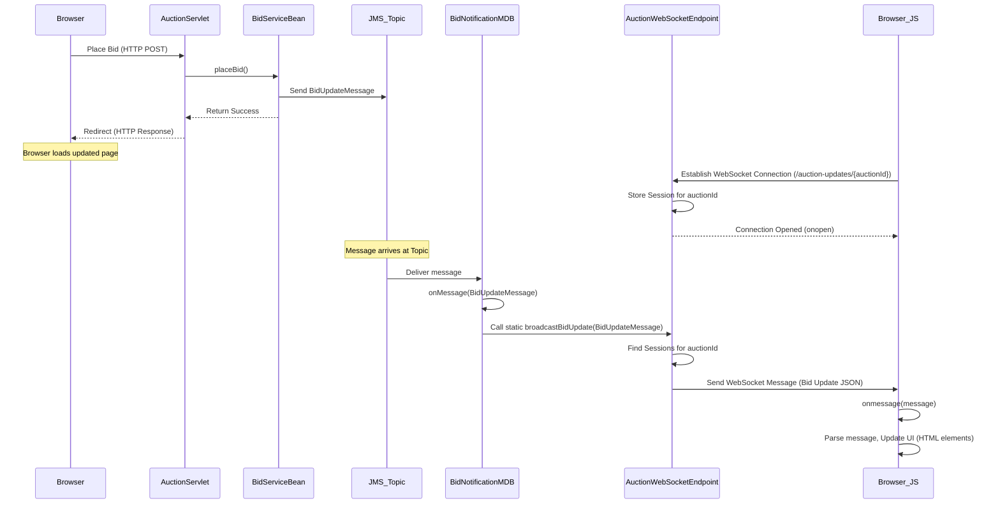

# Chapter 8: WebSocket Endpoint

Welcome back to the AuctionSystem tutorial! In the [previous chapter](07_jms_messaging__bid_notifications_.md), we learned how **JMS Messaging** provides a reliable, *asynchronous* way for our system's components to communicate. We saw how the `BidService` sends a message about a new bid to a JMS Topic, and how a `BidNotificationMDB` (Message-Driven Bean) picks up that message in the background.

Now, the `BidNotificationMDB` knows about the new bid, but how does it get that information *instantly* to the user's web browser? Traditional web applications require the browser to *ask* the server for updates (by refreshing the page or periodically making AJAX calls). This isn't truly real-time and can be inefficient.

Think about watching a live auction – you want to see new bids appear on your screen *the moment* they are placed, without having to keep hitting refresh. We need a direct, open line of communication between the server and the browser.

This is exactly what **WebSockets** provide.

## What is a WebSocket? The Open Phone Line

Imagine traditional HTTP requests are like sending letters: you write a request (letter), put it in an envelope, address it, and send it. The server receives it, processes it, puts the reply in another envelope, and sends it back. For every piece of information you want, you send a new letter and wait for a new reply.

**WebSockets** are different. They are like establishing a dedicated **phone line** between the user's browser and the server. Once the connection is established, it stays open. The browser can send messages to the server *at any time*, and more importantly for us, the server can send messages *to the browser* at any time, without the browser having to ask first.

This two-way, persistent connection is perfect for real-time applications like chat, online gaming, and, of course, updating auction bids instantly.

## Key Concept: The WebSocket Endpoint

In Java EE, the server-side component that handles a WebSocket connection is called a **WebSocket Endpoint**. It's essentially a class annotated with `@ServerEndpoint` that listens for incoming WebSocket connections on a specific URL path.

Our project uses `AuctionWebSocketEndpoint` (`src/main/java/com/auction/websocket/AuctionWebSocketEndpoint.java`) for this purpose. It's configured to listen on `/auction-updates/{auctionId}`:

```java
// --- Snippet from src/main/java/com/auction/websocket/AuctionWebSocketEndpoint.java ---
package com.auction.websocket;

import jakarta.websocket.*;
import jakarta.websocket.server.PathParam;
import jakarta.websocket.server.ServerEndpoint;
import java.util.logging.Logger;
// ... other imports ...

@ServerEndpoint(value = "/auction-updates/{auctionId}")
public class AuctionWebSocketEndpoint {

    private static final Logger logger = Logger.getLogger(AuctionWebSocketEndpoint.class.getName());

    // ... storage for sessions ...

    // WebSocket lifecycle methods:
    @OnOpen
    public void onOpen(Session session, @PathParam("auctionId") String auctionIdStr) {
        // Logic when a new browser connects
    }

    @OnMessage
    public void onMessage(String message, Session session) {
        // Logic when a browser sends a message TO the server
    }

    @OnClose
    public void onClose(Session session, CloseReason closeReason) {
        // Logic when a browser disconnects
    }

    @OnError
    public void onError(Session session, Throwable throwable) {
        // Logic when an error occurs on the connection
    }

    // Method to send messages TO the browsers
    public static void broadcastBidUpdate(BidUpdateMessage bidUpdate) {
        // Logic to send update to connected sessions for a specific auction
    }

    // ... other helper methods ...
}
```
*   `@ServerEndpoint(value = "/auction-updates/{auctionId}")`: This annotation tells the server that this Java class should handle WebSocket connections arriving at the URL path `/auction-updates/` followed by an auction ID (like `/auction-updates/123`). The `{auctionId}` part is a **path parameter**, meaning the value (e.g., `123`) is captured and made available to the methods.
*   `Session`: When a browser successfully connects via WebSocket, the server creates a `Session` object representing that specific connection. This object allows us to send messages back to that browser.
*   `@OnOpen`, `@OnMessage`, `@OnClose`, `@OnError`: These are annotations on methods that the server automatically calls at different points in the WebSocket connection's lifecycle.

## How it Works: From JMS to Browser

Let's see the flow from a bid being placed to the browser updating in real-time, incorporating what we learned in [Chapter 7: JMS Messaging](07_jms_messaging__bid_notifications_.md):



1.  A user places a bid via the standard HTTP flow ([Chapter 6](06_servlets__auction__sessionadmin_.md)).
2.  The `BidServiceBean` processes the bid and sends a message to the `JMS_Topic` ([Chapter 7](07_jms_messaging__bid_notifications_.md)). The HTTP request finishes quickly.
3.  The `BidNotificationMDB` receives the JMS message asynchronously ([Chapter 7](07_jms_messaging__bid_notifications_.md)).
4.  The MDB calls a **static method** (`broadcastBidUpdate`) on the `AuctionWebSocketEndpoint`. This is how the asynchronous JMS process triggers the real-time push.
5.  The `AuctionWebSocketEndpoint` looks up all the `Session` objects that are currently connected and associated with the specific `auctionId` from the bid update message.
6.  For each found `Session`, the endpoint sends a WebSocket message containing the bid details.
7.  Back in the user's browser (who is viewing the auction page and has established a WebSocket connection), the JavaScript code (`Browser_JS`) receives this message via its `onmessage` event handler.
8.  The JavaScript parses the message and updates the HTML elements on the page to show the new highest bid, bidder, and add the bid to the history – all without a page refresh!

This flow highlights how JMS (server-to-server asynchronous messaging) works together with WebSockets (server-to-browser real-time push) to deliver instant updates.

## Implementing the Server Endpoint (`AuctionWebSocketEndpoint.java`)

Let's look at the key parts of the `AuctionWebSocketEndpoint` class.

### Storing Sessions

The endpoint needs to keep track of which browsers are connected and, importantly, *which auction* each browser is interested in. A `Map` is used for this, mapping auction IDs to a collection of `Session` objects:

```java
// --- Snippet from src/main/java/com/auction/websocket/AuctionWebSocketEndpoint.java ---
// ... imports ...
import java.util.concurrent.ConcurrentHashMap; // Thread-safe map
import java.util.concurrent.CopyOnWriteArraySet; // Thread-safe set

@ServerEndpoint(value = "/auction-updates/{auctionId}")
public class AuctionWebSocketEndpoint {

    // Store sessions by auction ID
    // Using thread-safe collections is crucial as multiple connections/messages happen concurrently
    private static final ConcurrentHashMap<Long, CopyOnWriteArraySet<Session>> auctionSessions = new ConcurrentHashMap<>();

    // ... lifecycle methods and broadcast method ...
}
```
*   `auctionSessions`: A `ConcurrentHashMap` is used because multiple users might connect/disconnect or multiple messages might arrive simultaneously. It maps a `Long` (the auction ID) to a `CopyOnWriteArraySet` of `Session` objects. `CopyOnWriteArraySet` is another thread-safe collection suitable for situations where iteration is more common than modification (adding/removing sessions).

### Handling New Connections (`@OnOpen`)

When a browser connects to, for example, `/auction-updates/123`, the `@OnOpen` method is called.

```java
// --- Snippet from src/main/java/com/auction/websocket/AuctionWebSocketEndpoint.java ---
    @OnOpen
    public void onOpen(Session session, @PathParam("auctionId") String auctionIdStr) {
        try {
            Long auctionId = Long.parseLong(auctionIdStr);
            logger.info("WebSocket connection opened for auction: " + auctionId + ", session: " + session.getId());

            // Add session to the auction's set in the map
            // computeIfAbsent: if auctionId not in map, create a new set for it, then add session
            auctionSessions.computeIfAbsent(auctionId, k -> new CopyOnWriteArraySet<>()).add(session);

            // Store auction ID in session for later use (like in onClose/onError)
            session.getUserProperties().put("auctionId", auctionId);

            // Send initial connection confirmation back to this specific browser
            session.getBasicRemote().sendText("{\"type\":\"connection\",\"message\":\"Connected to auction " + auctionId + "\",\"auctionId\":" + auctionId + "}");

            logger.info("Total sessions for auction " + auctionId + ": " + auctionSessions.get(auctionId).size());

        } catch (NumberFormatException e) {
            logger.severe("Invalid auction ID: " + auctionIdStr);
            // Close the session if the ID is invalid
            try { session.close(new CloseReason(CloseReason.CloseCodes.CANNOT_ACCEPT, "Invalid auction ID")); } catch (IOException ex) { /* log */ }
        } catch (IOException e) {
             logger.warning("Failed to send connection confirmation: " + e.getMessage());
        }
    }
```
*   `@PathParam("auctionId")`: This annotation injects the value from the `{auctionId}` part of the URL into the `auctionIdStr` method parameter.
*   `Long.parseLong(auctionIdStr)`: Converts the String ID from the URL into a number.
*   `auctionSessions.computeIfAbsent(...).add(session)`: This is a thread-safe way to get the set of sessions for the given `auctionId`. If the set doesn't exist yet (first connection for this auction), `computeIfAbsent` creates a new `CopyOnWriteArraySet` for it. Then, the current `session` is added to that set.
*   `session.getUserProperties().put("auctionId", auctionId)`: Stores the `auctionId` directly within the `session` object. This makes it easy to retrieve the auction ID later in `onClose` or `onError` when we only have the `session` object available.
*   `session.getBasicRemote().sendText(...)`: Sends a simple text message (formatted as JSON) back to the browser that just connected. This confirms the connection was successful and includes the auction ID.

### Broadcasting Messages (`broadcastBidUpdate`)

This is the crucial method called by the `BidNotificationMDB` to send updates *to* all relevant browsers.

```java
// --- Snippet from src/main/java/com/auction/websocket/AuctionWebSocketEndpoint.java ---
    // Static method to broadcast bid updates to all connected clients for an auction
    // This is called by the BidNotificationMDB (see Chapter 7)
    public static void broadcastBidUpdate(BidUpdateMessage bidUpdate) {
        Long auctionId = bidUpdate.getAuctionId();
        // Get the set of sessions for this auction ID
        CopyOnWriteArraySet<Session> sessions = auctionSessions.get(auctionId);

        logger.info("Attempting to broadcast bid update for auction: " + auctionId);

        // Check if any sessions exist for this auction
        if (sessions == null || sessions.isEmpty()) {
            logger.info("No WebSocket sessions for auction: " + auctionId);
            return;
        }

        try {
            // Convert the BidUpdateMessage DTO to a JSON string
            String jsonMessage = objectMapper.writeValueAsString(bidUpdate);
            // Wrap the JSON in a simple structure for the client to identify the message type
            String webSocketMessage = "{\"type\":\"bidUpdate\",\"data\":" + jsonMessage + "}";

            logger.info("Broadcasting to " + sessions.size() + " sessions for auction: " + auctionId);
            logger.info("Message: " + webSocketMessage);

            // Iterate through all sessions for this auction and send the message
            sessions.removeIf(session -> { // Using removeIf to clean up closed sessions during iteration
                try {
                    if (session.isOpen()) {
                        session.getBasicRemote().sendText(webSocketMessage);
                        logger.info("Sent message to session: " + session.getId());
                        return false; // Keep this session in the set
                    } else {
                        logger.info("Session " + session.getId() + " is closed, removing");
                        return true; // Remove this closed session from the set
                    }
                } catch (Exception e) {
                    logger.warning("Failed to send message to session " + session.getId() + ": " + e.getMessage());
                    return true; // Remove this session from the set (due to error)
                }
            });

            logger.info("Broadcast completed for auction " + auctionId);

        } catch (Exception e) {
            logger.severe("Failed to broadcast bid update: " + e.getMessage());
            e.printStackTrace();
        }
    }
    // ... onClose, onError methods for removing sessions ...
```
*   `public static void broadcastBidUpdate(...)`: This method is `static` so it can be called directly from the `BidNotificationMDB` without needing a specific instance of the endpoint.
*   It gets the `auctionId` from the `BidUpdateMessage` (the DTO sent via JMS).
*   It retrieves the `CopyOnWriteArraySet` of `Session` objects for that `auctionId` from the `auctionSessions` map.
*   `objectMapper.writeValueAsString(bidUpdate)`: Uses a JSON library (`Jackson`) to convert our `BidUpdateMessage` DTO into a JSON string.
*   `String webSocketMessage = ...`: Creates the final message string sent over WebSocket. It's a simple JSON structure containing a `type` ("bidUpdate") and the `data` (our `BidUpdateMessage` as JSON). The client-side JavaScript uses the `type` field to know how to handle the message.
*   `sessions.removeIf(...)`: This is the core loop. It iterates through all sessions in the set.
*   `session.isOpen()`: Checks if the connection is still active.
*   `session.getBasicRemote().sendText(webSocketMessage)`: Sends the JSON message string to the connected browser associated with this `session`. `getBasicRemote` provides a simple way to send text messages asynchronously.
*   The `removeIf` logic also cleans up any sessions that are no longer open, removing them from the set.

### Server-Side Registration (`WebSocketConfigurator.java`)

For the server to know about our `AuctionWebSocketEndpoint`, it needs to be registered. This is often done using a `ServletContextListener`.

```java
// --- Snippet from src/main/java/com/auction/config/WebSocketConfigurator.java ---
package com.auction.config;

import jakarta.servlet.ServletContextEvent;
import jakarta.servlet.ServletContextListener;
import jakarta.servlet.annotation.WebListener; // Annotation to make it a listener
import jakarta.websocket.server.ServerContainer; // Provides server WebSocket capabilities
import com.auction.websocket.AuctionWebSocketEndpoint; // Our endpoint class
import java.util.logging.Logger;

@WebListener // Tells the server this class listens to servlet context events
public class WebSocketConfigurator implements ServletContextListener {

    private static final Logger logger = Logger.getLogger(WebSocketConfigurator.class.getName());

    @Override
    public void contextInitialized(ServletContextEvent sce) {
        try {
            // Get the server's WebSocket container
            ServerContainer serverContainer = (ServerContainer) sce.getServletContext()
                    .getAttribute("jakarta.websocket.server.ServerContainer");

            if (serverContainer != null) {
                // Register our endpoint class with the container
                serverContainer.addEndpoint(AuctionWebSocketEndpoint.class);
                logger.info("WebSocket endpoint registered successfully: " + AuctionWebSocketEndpoint.class.getSimpleName());
            } else {
                logger.severe("ServerContainer not found - WebSocket not supported");
            }
        } catch (Exception e) {
            logger.severe("Failed to register WebSocket endpoint: " + e.getMessage());
            e.printStackTrace();
        }
    }

    @Override
    public void contextDestroyed(ServletContextEvent sce) {
        logger.info("WebSocket configurator destroyed");
        // No specific cleanup needed for the endpoint registration itself here
    }
}
```
*   `@WebListener`: Marks this class to be notified about servlet context lifecycle events (application startup/shutdown).
*   `contextInitialized`: This method is called by the server when the web application starts.
*   It retrieves the `ServerContainer`, which is the server's built-in component for managing WebSockets.
*   `serverContainer.addEndpoint(AuctionWebSocketEndpoint.class)`: This is the crucial step – it registers our endpoint class with the server's WebSocket engine, making it available at the defined `@ServerEndpoint` URL.

## Implementing the Client Side (`auction-websocket.js`)

The user's web browser uses JavaScript to interact with the WebSocket endpoint. The file `src/main/webapp/js/auction-websocket.js` contains this logic, used by the example `real-time-notifications.html` page.

### Establishing Connection

The JavaScript creates a `WebSocket` object, providing the URL of our server endpoint.

```javascript
// --- Snippet from src/main/webapp/js/auction-websocket.js ---
class AuctionWebSocket {
    constructor(auctionId) {
        this.auctionId = auctionId;
        this.websocket = null; // Holds the WebSocket object

        this.connect(); // Call connect immediately
    }

    connect() {
        // Construct the WebSocket URL based on the current page's location
        const protocol = window.location.protocol === 'https:' ? 'wss:' : 'ws:';
        const host = window.location.host;
        const contextPath = window.location.pathname.split('/')[1]; // e.g., "AuctionSystem"

        // Build the URL using the context path and auction ID
        const wsUrl = `${protocol}//${host}/${contextPath}/auction-updates/${this.auctionId}`;

        console.log('Connecting to WebSocket:', wsUrl);

        // Create the new WebSocket connection
        this.websocket = new WebSocket(wsUrl);

        // Assign event handlers
        this.websocket.onopen = (event) => this.onOpen(event);
        this.websocket.onmessage = (event) => this.onMessage(event);
        this.websocket.onclose = (event) => this.onClose(event);
        this.websocket.onerror = (error) => this.onError(error);
    }

    // ... onOpen, onMessage, onClose, onError methods ...
}

// Global function called by a button click in real-time-notifications.html
function connectToAuction() {
    const auctionId = document.getElementById('auction-id').value; // Get ID from input field
    if (auctionWebSocket && auctionWebSocket.isConnected) {
        auctionWebSocket.disconnect(); // Disconnect existing if any
        setTimeout(() => { auctionWebSocket = new AuctionWebSocket(auctionId); }, 500);
    } else {
        auctionWebSocket = new AuctionWebSocket(auctionId); // Create new
    }
}
```
*   `new WebSocket(wsUrl)`: This standard browser API creates a WebSocket connection attempt to the specified URL.
*   The URL is dynamically built using `window.location` to ensure it points to the correct server address and application context path (`/AuctionSystem`).
*   The `{auctionId}` from the URL path parameter on the server side is included in the client URL to tell the server which auction updates this client wants.
*   `this.websocket.onopen = ...`, etc.: Assigns JavaScript functions to handle different events that happen on the WebSocket connection.

### Handling Incoming Messages (`onmessage`)

When the server sends a message (like our bid update JSON), the `onmessage` function in the JavaScript is triggered. The message data is available in `event.data`.

```javascript
// --- Snippet from src/main/webapp/js/auction-websocket.js ---
    onMessage(event) {
        console.log('WebSocket message received:', event.data);
        try {
            // Parse the incoming message string as JSON
            const message = JSON.parse(event.data);
            // Call a helper method to process different message types
            this.handleMessage(message);
        } catch (e) {
            console.error('Failed to parse WebSocket message:', e);
            this.addNotification(`❌ Failed to parse message: ${e.message}`, 'error'); // Update UI log
        }
    }

    handleMessage(message) {
        switch (message.type) {
            case 'connection': // Initial confirmation message from server
                console.log('Connection message:', message.message);
                this.addNotification(`🔗 ${message.message}`, 'info'); // Update UI log
                break;

            case 'bidUpdate': // Our bid update message from the server
                console.log('Bid update received:', message.data);
                // Call methods to update the HTML display
                this.updateBidDisplay(message.data);
                this.showBidNotification(message.data); // Show a temporary visual alert
                this.addBidNotification(message.data); // Add to the persistent log
                break;

            // ... other message types (like 'heartbeat') ...
            default:
                console.log('Unknown message type:', message.type);
                this.addNotification(`❓ Unknown message type: ${message.type}`, 'warning'); // Update UI log
        }
    }

    updateBidDisplay(bidData) {
        // Find HTML elements by their IDs
        const highestBidElement = document.getElementById('highest-bid');
        const highestBidderElement = document.getElementById('highest-bidder');
        const bidHistoryElement = document.getElementById('bid-history');

        // Update the text content of the HTML elements
        if (highestBidElement) {
            highestBidElement.textContent = '$' + bidData.bidAmount.toFixed(2);
             // Add a simple animation effect (optional)
            highestBidElement.style.transform = 'scale(1.1)';
            setTimeout(() => { highestBidElement.style.transform = 'scale(1)'; }, 200);
        }
        if (highestBidderElement) {
            highestBidderElement.textContent = bidData.bidderUsername;
            // Add a simple animation effect (optional)
             highestBidderElement.style.transform = 'scale(1.1)';
             setTimeout(() => { highestBidderElement.style.transform = 'scale(1)'; }, 200);
        }

         // Add a new entry to the bid history list
         if (bidHistoryElement) {
             // Remove the "No bids yet" empty state if it's there
             const emptyState = bidHistoryElement.querySelector('.empty-state');
             if (emptyState) { emptyState.remove(); }

             const bidElement = document.createElement('div');
             bidElement.className = 'bid-item new-bid'; // Add class for styling/animation
             // Build the HTML for the new bid entry
             bidElement.innerHTML = `
                 <div class="bid-amount">$${bidData.bidAmount.toFixed(2)}</div>
                 <div class="bid-user">${bidData.bidderUsername}</div>
                 <div class="bid-time">${new Date().toLocaleTimeString()}</div>
             `;
             // Add the new bid entry to the top of the history list
             bidHistoryElement.insertBefore(bidElement, bidHistoryElement.firstChild);

             // Remove the highlight class after animation
             setTimeout(() => { bidElement.classList.remove('new-bid'); }, 2000);

             // Keep the history list from getting too long
             const bidItems = bidHistoryElement.querySelectorAll('.bid-item');
             if (bidItems.length > 20) { bidItems[bidItems.length - 1].remove(); }
         }
    }
    // ... onClose, onError, etc. ...
}
```
*   `JSON.parse(event.data)`: Converts the JSON string received from the server back into a JavaScript object.
*   `message.type`: The JavaScript checks the `type` field in the received JSON to determine what kind of message it is ("connection", "bidUpdate", etc.) and calls the appropriate handling logic.
*   `message.data`: For a "bidUpdate" message, the actual bid information is in the `data` field (matching the JSON structure sent by the server endpoint).
*   `updateBidDisplay(message.data)`: This function takes the bid data object and uses standard JavaScript DOM manipulation (`document.getElementById`, `textContent`, `createElement`, `innerHTML`, `insertBefore`) to find the HTML elements that display the highest bid, bidder, and bid history, and updates their content with the new information. It makes the new bid entry visually distinct temporarily (`new-bid` class).

This client-side JavaScript code is what makes the browser react instantly to messages pushed by the server via the WebSocket connection, achieving the real-time feel.

## Summary

In this chapter, we successfully implemented **real-time updates** using WebSockets:

*   **WebSockets** provide a persistent, two-way communication channel between the server and the browser, unlike traditional request/response HTTP.
*   On the server, the **`AuctionWebSocketEndpoint`** ([`src/main/java/com/auction/websocket/AuctionWebSocketEndpoint.java`](#file-srcmainjavacomauctionwebsocketauctionwebsocketendpointjava)) is the Java class that handles these connections, using `@ServerEndpoint` to map a URL path (including a path parameter for the auction ID).
*   The endpoint uses `@OnOpen`, `@OnMessage`, `@OnClose`, and `@OnError` to manage the lifecycle of connections.
*   It stores active connections in a thread-safe collection (`ConcurrentHashMap`, `CopyOnWriteArraySet`), mapping auction IDs to the relevant browser sessions.
*   A static method (`broadcastBidUpdate`) on the endpoint is called by the `BidNotificationMDB` ([Chapter 7](07_jms_messaging__bid_notifications_.md)) when a new bid JMS message is processed.
*   This broadcast method finds all browser sessions connected for the specific auction and sends a JSON message containing the bid update to each using `session.getBasicRemote().sendText()`.
*   The endpoint is registered with the server's WebSocket container using a `ServletContextListener` ([`src/main/java/com/auction/config/WebSocketConfigurator.java`](#file-srcmainjavacomauctionconfigwebsocketconfiguratorjava)) at application startup.
*   On the client side, JavaScript in the browser creates a `WebSocket` object and uses its `onmessage` event handler to receive the JSON updates from the server.
*   The JavaScript parses the JSON and updates the HTML elements on the page to display the new bid information in real-time, without a page refresh.

WebSockets, triggered by the asynchronous JMS messages processed by the MDB, close the loop for delivering instant bid notifications to users viewing an auction, providing a dynamic and engaging user experience.

With this, we have covered the core components of the `AuctionSystem`, from managing user sessions and handling business logic to providing real-time updates via messaging and WebSockets.

Thank you for following this tutorial on the AuctionSystem project!

---
