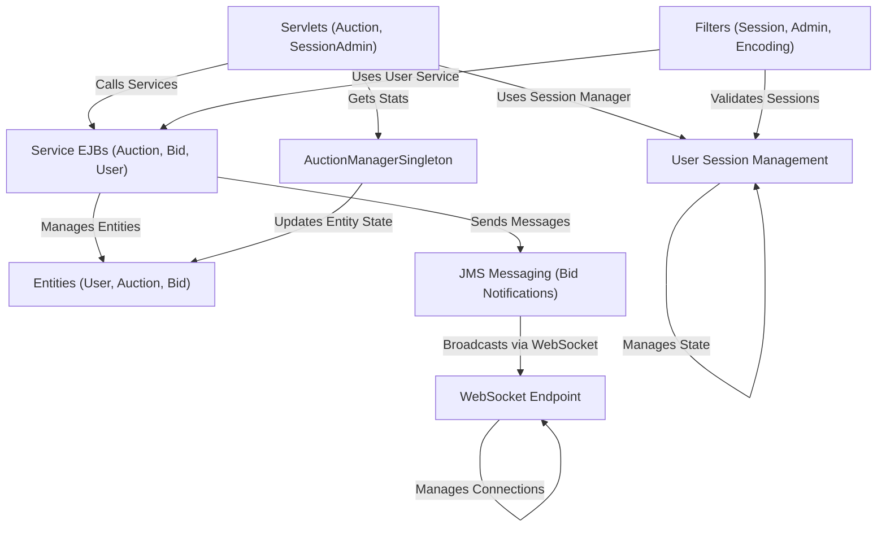

# Auction-System-Documentation

This project is an **online auction system** where users can **register**, **log in**, and **place bids** on items.
It features **real-time bid updates** using messaging and WebSockets, manages user sessions securely, and includes an **administrator panel** to monitor activity and sessions.
Auctions are **managed** through EJBs and automatically **closed** when they expire.

## Visual Overview

## Chapters

1. [User Session Management
](01_user_session_management_.md)
2. [Entities (User, Auction, Bid)
](02_entities__user__auction__bid__.md)
3. [Service EJBs (Auction, Bid, User)
](03_service_ejbs__auction__bid__user__.md)
4. [Filters (Session, Admin, Encoding)
](04_filters__session__admin__encoding__.md)
5. [AuctionManagerSingleton
](05_auctionmanagersingleton_.md)
6. [Servlets (Auction, SessionAdmin)
](06_servlets__auction__sessionadmin__.md)
7. [JMS Messaging (Bid Notifications)
](07_jms_messaging__bid_notifications__.md)
8. [WebSocket Endpoint
](08_websocket_endpoint_.md)

---
